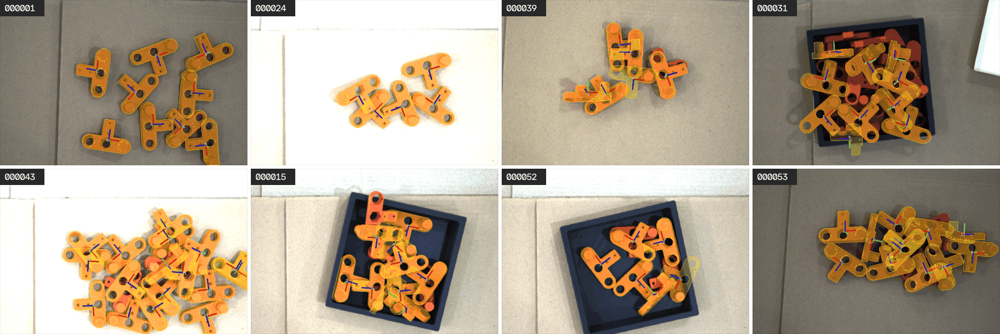
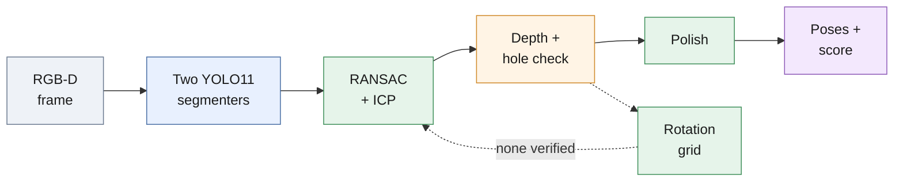

# 6-DoF pose estimation of a rigid part in bin-picking scenes

Candidate submission for the Eureka Robotics assignment (Boi Vu Cong). The assignment text is [ASSIGNMENT.md](ASSIGNMENT.md); the write-up is [report.md](report.md).



*Predicted poses drawn on eight test scenes; all 40 are in [overlays_test/](overlays_test/).*

## Results at a glance

| AR | top-1 | Required instances at 10 mm | Time per pick |
| --- | --- | --- | --- |
| 0.851 | 1.000 | 112 / 117 | 0.7 s desktop GPU · 2.7 s Jetson Nano 4 GB (measured) |

Leave-scenes-out cross-validation on the 20 train scenes with the released `score.py` (`results/train_ensemble_run1.json`; a second draw gives the same AR). The 5 unmatched instances are duplicate ground-truth labels, so 112 / 117 is the ceiling for any one-pose-per-part submission ([analysis/failure_analysis.md](analysis/failure_analysis.md)). Time per pick is `--pick` mode: stop at the first pose scoring at least 0.8 ([analysis/runtime.md](analysis/runtime.md)); the Jetson figure is the board profile, one YOLO11n segmenter at 640 px ([deploy/jetson-nano/README.md](deploy/jetson-nano/README.md)). Every accuracy number in this repository re-scores from a file in [results/](results/).

## How it works



*Two segmenters (one trained on the 20 real scenes, one only on synthetic CAD renders) propose masks; classical geometry registers, verifies and polishes each pose; `score` = segmenter confidence × depth verification.*

- Masks come from a network because segmentation is what a network learns best from 20 images.
- Pose comes from geometry because the depth channel answers it better than a regressor trained on 20 scenes.
- Every pose is verified against free space, so a wrong pose gets a low score, not a confident mistake.

Details: [report.md#method](report.md#method).

## Run it

`<release>` is a folder holding `model/` and the split to run (`test/`); `.` if the assignment dataset is unpacked into this clone.

```bash
./setup.sh                                   # .venv from the pinned lock; auto-detects CUDA, or --cpu | --cuda
./run_all.sh <release> test                  # -> out_<release name>_test/submission.json + overlays/ (+ score.py if poses.json present)
WORKERS=2 ./run_all.sh <release> test        # small machines
.venv/bin/python score.py --release <release> --split train --submission results/train_ensemble_run1.json   # AR 0.851
```

Docker, no network at run time:

```bash
docker build -f deploy/Dockerfile -t pose-est:cpu . && docker run --rm --network none \
    -v <release>:/data:ro -v $PWD/out:/out pose-est:cpu /data test /out
```

Needs Python 3.12 (other versions fall back to the unpinned [requirements.txt](requirements.txt)), about 2 GB RAM per worker, GPU optional. The 40 test scenes take 135 s at 6 workers on a desktop GPU, 160 s CPU-only ([analysis/runtime.md](analysis/runtime.md)).

## What is where

| Path | Contents |
| --- | --- |
| [ASSIGNMENT.md](ASSIGNMENT.md) | The assignment as received |
| [report.md](report.md) | Method, results, analysis, limitations, deployment, tools |
| [submission.json](submission.json) | 363 poses over the 40 test scenes |
| [overlays_test/](overlays_test/) | Predicted poses drawn on the test images, one per scene |
| [src/](src/README.md) | Pipeline modules: loading, segmentation, registration, verification, polish |
| [scripts/](scripts/README.md) | Entry points: run the pipeline, cross-validate, ablate, analyse, train segmenters |
| [weights/](weights/README.md) | Segmenter weights: real-trained, synthetic-only, edge (nano) |
| [results/](results/README.md) | Prediction JSONs behind every table row, ablation, and board benchmark |
| [analysis/](analysis/README.md) | Failure analysis, score calibration, ablation, runtime, edge model, board profile |
| [docs/figures/](docs/figures/) | Plots used by README and report |
| [deploy/](deploy/README.md) | Camera service, pose service, cell layer, Docker, offline install, Jetson Nano |
| [setup.sh](setup.sh) / [run_all.sh](run_all.sh) | Environment from the pinned lock / one-command run on any release folder |
| [score.py](score.py) / [visualize.py](visualize.py) | Released by Eureka, unchanged |
| [requirements.txt](requirements.txt) | Unpinned dependencies; the pinned lock is `deploy/requirements-lock.txt` |

## Deployment

The same pipeline runs as a camera service, a pose service and a cell layer (grasp planning, hand-eye, pick policy); see [deploy/README.md](deploy/README.md) and [deploy/ARCHITECTURE.md](deploy/ARCHITECTURE.md).
Measured on a Jetson Nano 4 GB, CPU only: 2.6-2.7 s per pick, 624 MB peak RSS, poses matching the desktop to 0.04 mm / 0.14° (`results/bench/board_nano640.json`, [deploy/jetson-nano/README.md](deploy/jetson-nano/README.md)).
The single-process cell demo (`deploy/jetson-nano/cell_demo.py`) has not yet been run on the board.

## Tools

Developed with Claude Code (Anthropic) as a coding assistant under my direction; libraries Open3D, OpenCV, NumPy, SciPy, trimesh, matplotlib, Ultralytics YOLO11, BlenderProc; no external images or labels. Full disclosure: [report.md#tools-disclosure](report.md#tools-disclosure).
