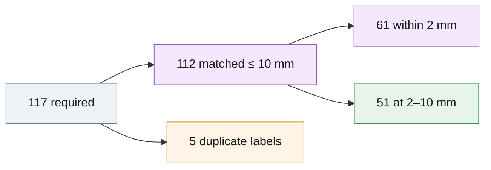

# `analysis/` — six short studies on the CV predictions

Each study reads files in [results/](../results/README.md), states how it was
measured, and can be regenerated by a script in [scripts/](../scripts/README.md).
Numbers are leave-scenes-out CV on the 20 train scenes unless the row says
otherwise; the noise band is ±0.005 AR for two-segmenter rows and ±0.015 for
single-segmenter rows.

| Study | Question | Answer (key number) | Figure | Regenerate with |
| --- | --- | --- | --- | --- |
| [failure_analysis.md](failure_analysis.md) | Where is the remaining error at 10 mm? | 112 of 117 required instances matched; the 5 missed are duplicate GT labels (000022 #4, #8; 000030 #3, #6; 000041 #5), the ceiling for any one-pose-per-part submission. All 34 false positives are wrong registrations of real parts, none on background. | [failure_breakdown.png](../docs/figures/failure_breakdown.png), [failures/](failures/) | `scripts/analyze_failures.py --root . --submission results/train_ensemble_run1.json --out analysis` |
| [score_calibration.md](score_calibration.md) | Can a robot cell gate picks on `score`? | Ranking is reliable (AUROC 0.94 for within 5 mm) but not a probability (ECE 0.143). Gate 0.7 → precision 0.989 at 10 mm, AR 0.716, top-1 1.000: the recommended cell gate. | [score_calibration.png](score_calibration.png) | `scripts/score_calibration.py --root . --submission results/train_ensemble_run1.json --out analysis` |
| [ablation.md](ablation.md) | What does each stage buy? | Rotation-grid fallback is the largest (−0.054 AR without it); RGB hole cue +0.007 AR; own-mask check +0.03 precision; colour gate is pure precision (0.599 → 0.767); polish 3 instances at 2 mm; flip rivals ±0 on this path. | [ablation_bars.png](../docs/figures/ablation_bars.png) | `scripts/eval_seg_folds.py ... --ablate <stage>` (rows in [results/](../results/README.md#ablation-rows)) |
| [runtime.md](runtime.md) | Where does the time go, how fast is a pick? | Registration chain 96.1 % of scene time (ICP 40.1 %, FPFH-RANSAC 33.4 %, grid 10.9 %), segmenters 2.1 %. 40 test scenes in 135 s at 6 workers on GPU, 160 s CPU-only; pick mode 0.7 s mean / 2.1 s max on GPU, 1.6–2.4 s CPU on 4 cores. Desktop i5-14600K / RTX 4070 Ti SUPER. | [runtime_breakdown.png](../docs/figures/runtime_breakdown.png) | `scripts/run_pipeline.py --workers N [--pick]`; the stage profile came from wall-clock wrappers, not a shipped script |
| [nano_profile.md](nano_profile.md) | What do fewer segmenters or a smaller input side cost on a 4 GB board? | Input side 960 → 640 is nearly free (single 0.829 → 0.827, dual 0.851 → 0.844); dropping the second segmenter costs about one instance of AR and halves the false positives. Recommendation: one segmenter at 640 in pick mode. | [edge_tradeoff.png](../docs/figures/edge_tradeoff.png) | `scripts/eval_seg_folds.py --imgsz ...` (rows in [results/](../results/README.md#jetson-segmenter-profile-rows)); latency rows in `results/nano_runtime.json` |
| [edge_model.md](edge_model.md) | Does a small segmenter trained at 640 lose pose accuracy? | No: YOLO11n-seg @640 (6.0 MB) reaches AR 0.837 (mean of three draws) vs 0.838 for YOLO11l downscaled to 640 vs 0.851 shipped, at 49 ms vs 619 ms per frame CPU. The board runs it. The `.onnx` export was validated structurally, never executed. | [edge_tradeoff.png](../docs/figures/edge_tradeoff.png), [board_vs_desktop.png](../docs/figures/board_vs_desktop.png) | `scripts/eval_seg_folds.py --runs seg_runs_n --imgsz 640` after the `yolo segment train` recipe in the file |

*The 10 mm gap is labels the metric cannot reach; the 2 mm gap is the depth
sensor's 1 mm quantisation, which no refinement recovers
([failure_analysis.md](failure_analysis.md), `results/train_ensemble_run1.json`).*

## `failures/` — crops of the misses

Eight PNGs named `<scene>_inst<k>_mssd<mm>mm.png`: RGB crop, ground-truth
silhouette in green, nearest unclaimed prediction in red, `<mm>` its MSSD.

| Files | What they show |
| --- | --- |
| `000014_inst01_mssd75mm`, `000041_inst00_mssd73mm`, `000047_inst03_mssd74mm` | stem-axis flips missed in earlier draws, kept because they show the failure mode the RGB hole cue addresses; all three are matched in `train_ensemble_run1.json` |
| `000022_inst04_mssd3mm`, `000022_inst08_mssd3mm`, `000041_inst05_mssd1mm` | duplicate labels: green and red coincide, the red pose is the twin's match |
| `000030_inst03_mssd10mm`, `000030_inst06_mssd10mm` | duplicate labels of an edge-on part whose single pose is itself 9.7 mm off |

[score_calibration.png](score_calibration.png) (reliability diagram and
operating points) is written by `scripts/score_calibration.py`; the other
plots live in [docs/figures/](../docs/figures/) and are written by
`scripts/make_figures.py`.
