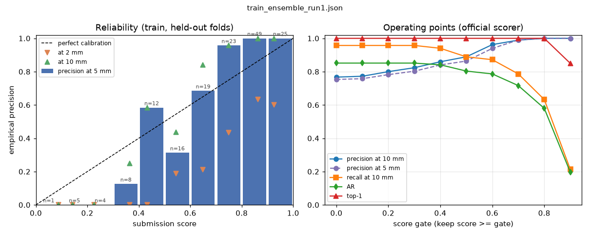

# Score calibration

Submission `train_ensemble_run1.json`: 185 predictions over 20 scenes; 23 land on ignore regions (unlabelled instances) and are dropped, as the scorer drops them. `score` = segmenter confidence x depth verification; a prediction is correct when the scorer's greedy matching pairs it with any instance within the threshold.

## Reliability

| score bin | n | mean score | prec@2mm | prec@5mm | prec@10mm |
|---|---|---|---|---|---|
| 0.0-0.1 | 1 | 0.088 | 0.00 | 0.00 | 0.00 |
| 0.1-0.2 | 5 | 0.143 | 0.00 | 0.00 | 0.00 |
| 0.2-0.3 | 4 | 0.227 | 0.00 | 0.00 | 0.00 |
| 0.3-0.4 | 8 | 0.364 | 0.00 | 0.12 | 0.25 |
| 0.4-0.5 | 12 | 0.433 | 0.00 | 0.58 | 0.58 |
| 0.5-0.6 | 16 | 0.544 | 0.19 | 0.31 | 0.44 |
| 0.6-0.7 | 19 | 0.648 | 0.21 | 0.68 | 0.84 |
| 0.7-0.8 | 23 | 0.749 | 0.43 | 0.96 | 0.96 |
| 0.8-0.9 | 49 | 0.862 | 0.63 | 1.00 | 1.00 |
| 0.9-1.0 | 25 | 0.925 | 0.60 | 1.00 | 1.00 |

ECE at 5 mm: **0.143**; Brier score at 5 mm: **0.100**.

## Operating points (official `score.py`, predictions with score >= gate)

| gate | preds/scene | recall@10 | precision@10 | recall@2 | precision@2 | AR | top-1 | prec@5 (replay) |
|---|---|---|---|---|---|---|---|---|
| 0.0 | 9.2 | 0.957 | 0.767 | 0.521 | 0.381 | 0.851 | 1.000 | 0.753 |
| 0.1 | 9.2 | 0.957 | 0.772 | 0.521 | 0.384 | 0.851 | 1.000 | 0.758 |
| 0.2 | 8.9 | 0.957 | 0.800 | 0.521 | 0.396 | 0.851 | 1.000 | 0.782 |
| 0.3 | 8.5 | 0.957 | 0.824 | 0.521 | 0.407 | 0.851 | 1.000 | 0.803 |
| 0.4 | 8.1 | 0.940 | 0.859 | 0.521 | 0.430 | 0.841 | 1.000 | 0.840 |
| 0.5 | 7.3 | 0.889 | 0.889 | 0.521 | 0.469 | 0.803 | 1.000 | 0.864 |
| 0.6 | 6.2 | 0.872 | 0.962 | 0.504 | 0.513 | 0.786 | 1.000 | 0.940 |
| 0.7 | 5.0 | 0.786 | 0.989 | 0.470 | 0.573 | 0.716 | 1.000 | 0.990 |
| 0.8 | 3.7 | 0.632 | 1.000 | 0.393 | 0.622 | 0.580 | 1.000 | 1.000 |
| 0.9 | 1.2 | 0.214 | 1.000 | 0.128 | 0.600 | 0.197 | 0.850 | 1.000 |

## Top-1 per scene

| scene | top score | MSSD (mm) |
|---|---|---|
| 000047 | 0.854 | 2.52 |
| 000030 | 0.881 | 1.76 |
| 000009 | 0.883 | 1.16 |
| 000033 | 0.901 | 1.79 |
| 000011 | 0.904 | 1.58 |
| 000058 | 0.910 | 1.89 |
| 000023 | 0.911 | 1.10 |
| 000054 | 0.914 | 2.38 |
| 000026 | 0.919 | 2.17 |
| 000020 | 0.923 | 3.06 |
| 000021 | 0.924 | 0.91 |
| 000041 | 0.924 | 1.29 |
| 000014 | 0.926 | 2.03 |
| 000022 | 0.929 | 1.36 |
| 000007 | 0.932 | 2.54 |
| 000010 | 0.933 | 1.87 |
| 000019 | 0.943 | 3.21 |
| 000059 | 0.949 | 0.72 |
| 000008 | 0.963 | 2.80 |
| 000040 | 0.970 | 0.82 |

Least confident top pick: score 0.854; worst top-1 MSSD 3.21 mm; top-1 scores below 0.5: 0 of 20.

## Other configurations (same analysis)

| submission | n | ECE@5 | Brier@5 | prec@5 for score>=0.6 | min top-1 score |
|---|---|---|---|---|---|
| train_yolo11l_single.json | 152 | 0.157 | 0.096 | 0.95 | 0.805 |
| train_synthetic_only.json | 168 | 0.138 | 0.091 | 0.95 | 0.854 |

## Component split (54 predictions on 5 held-out scenes, 45 correct at 5 mm)

Detection re-run with the fold segmenter that never saw the scene plus the synthetic model (conf 0.25); RANSAC makes the figures move by a few points between runs.

| factor | AUROC vs correct@5mm |
|---|---|
| segmenter confidence | 0.951 |
| verification | 0.941 |
| product (score) | 0.958 |

## Conclusion

1. **Ranking is trustworthy.** AUROC of `score` against correct-at-5-mm is 0.94 over 162 labelled predictions; the top pick of every scene scores >= 0.854 and lies within 3.21 mm (top-1 20/20, never below 0.5).
2. **As a probability it is only roughly calibrated** (ECE 0.143, Brier 0.100 at 5 mm): over-confident in the middle bins, under-confident above ~0.7 (see table). A monotone recalibration (isotonic on the CV predictions) would fix the level without changing the ranking; the raw product should be read as a rank, not a probability.
3. **Operating point.** Gate 0.6: 6.2 preds/scene, precision 0.94 at 5 mm / 0.962 at 10 mm, recall 0.872 at 10 mm, AR 0.786. Gate 0.7: precision 0.99 at 5 mm, recall 0.786. Precision at 5 mm first reaches 0.95 at gate 0.7; the knee is 0.6-0.7, and below 0.4 a prediction is wrong more often than right.
4. **Which factor carries it:** AUROC verification 0.94, segmenter 0.95, product 0.96 -- both factors are individually predictive and the product is at least as good as either; 54 predictions on 5 scenes, so a few points of difference are noise.
5. **For a robot cell:** pick from `score` >= 0.7, rescan when nothing reaches it; the gate trades recall for precision without touching the top pick up to gate 0.8.