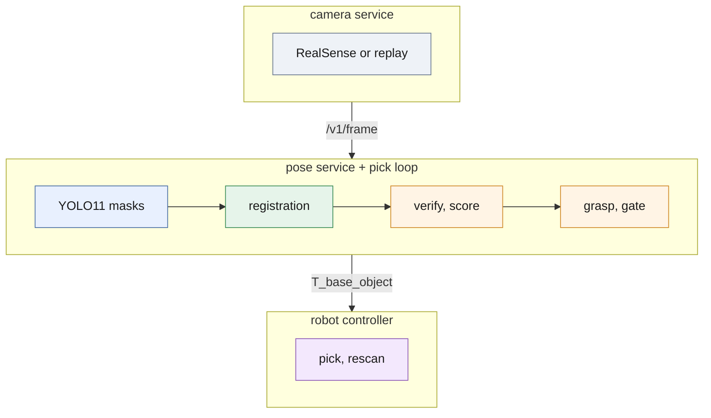
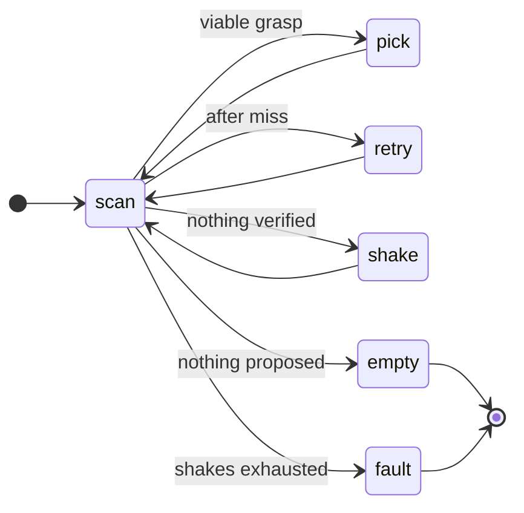

# The cell on one device

Three processes on the board, one loop, nothing off-device:



*The camera serves RGB-D frames with intrinsics; the pose service turns one frame into verified poses with a score; the pick layer picks a grasp and gates it; the controller picks, then rescans.*

The split is deliberate and matches how a vision cell is actually built: the
camera is a device with a driver and a frame rate, the vision system is a
service with a model and a confidence, and the controller owns motion. Each
runs as its own process with its own health endpoint, so a failure is
attributable — a stalled camera and a slow model look different in the logs,
which is the difference between a five-minute fix and a day of guessing.

## What each process owns

| Process | Owns | Endpoint | Fails how |
| ------- | ---- | -------- | --------- |
| [`camera/`](camera/) | the sensor: frames, intrinsics, depth scale, frame ids | `/v1/frame`, `/v1/intrinsics`, `/preview.mjpg`, `/healthz`, `/metrics` | a dropped frame increments a counter; the stream continues |
| [`pose/`](pose/) | the model and the geometry: masks, registration, verification, `score` | `/v1/estimate`, `/healthz`, `/readyz`, `/metrics` | a bad frame returns an empty pose list with an error field |
| [`pick/`](pick/) | the decision: grasp choice, robot frame, pick policy, drift watch | library, driven by the pick loop (`pick/runner.py`) | no viable grasp returns reasons, and the policy escalates rescan → shake → stop |

## Why the pieces are what they are

**The camera is a service, not a library call.** A real cell replaces the
camera without touching the vision code — a RealSense today, a different 3D
camera next year — and the same interface replays recorded scenes when no
hardware is attached. That is what makes the whole system testable on a
laptop and on the board, and it is why `/preview.mjpg` exists: an engineer
standing at the cell wants to see what the camera sees, in a browser, without
a debugger.

**The vision service returns a confidence, not just a pose.** `score` is
segmenter confidence × depth verification, and on cross-validated data
`score ≥ 0.7` carries ~0.99 precision at 5 mm
([`../analysis/score_calibration.md`](../analysis/score_calibration.md)).
A cell that picks below its gate is guessing; a cell that rescans instead is
slower for one cycle and right. Every pose the service returns carries the
configuration digest that produced it, so a pick can be traced back to a model
and a threshold months later.

**The pick layer converts a pose into an action.** An object pose is not a
grasp: the robot needs a tool pose in its own base frame, an approach vector
with clearance, and a reason when there is nothing safe to pick. That is
`deploy/pick/` — grasp definitions in the CAD frame, hand-eye to reach the
robot frame, a policy state machine, and a drift monitor that watches for the
slow miscalibration that degrades a cell over weeks rather than breaking it
in a minute.

## The pick policy

[`pick/policy.py`](pick/policy.py) writes the cycle down as six states, so
what happens on the third consecutive miss can be read in one place:



*Every decision starts from a scan; a frame with nothing verified is rescanned twice before the bin is shaken, three shakes without progress end in `fault` (parts present) or `empty` (nothing proposed), and a drift verdict of "recalibrate" is a `fault` at once.*

## Running it

On any machine with the environment (`./setup.sh`) and the release folder
(`model/`, `test/`) unpacked at the repository root:

```bash
# terminal 1 — camera, replaying the test split (CAM_ROOT=<release> for another location)
.venv/bin/python -m deploy.camera.server

# terminal 2 — vision, on the board profile
.venv/bin/python -m deploy.pose.server --config deploy/board/config.nano.json

# terminal 3 — one cycle, or a loop (--cycles 0)
.venv/bin/python -m deploy.pick.runner --once
```

Both services read a JSON config (`--config`) under `CAM_*` / `POSE_*`
environment overrides; the camera also replays a recording made with
`deploy.camera.record` (`CAM_SOURCE=session CAM_ROOT=<session dir>`).

On the board the pose service comes up as a systemd unit
([`board/pose-service.service`](board/pose-service.service));
the runbook is [`board/README.md`](board/README.md). For a
demonstration or a first check on new hardware,
[`demo/cell_demo.py`](demo/cell_demo.py) collapses the three
processes into one — same estimator, planner, policy and renderer, one model
load, no loopback — and writes the annotated video as it goes. It runs on a
desktop; it has not yet been run on the board. The split above is how a line
is built; the single file is how a board is answered. The batch entry points
(`run_all.sh`, `scripts/run_pipeline.py`) stay exactly as they were — the
service layer wraps the same pipeline rather than forking it, and
`deploy/pose/service.py` calls the same `detect_scene_hybrid` and
`PoseEstimator` that produced the submission.
