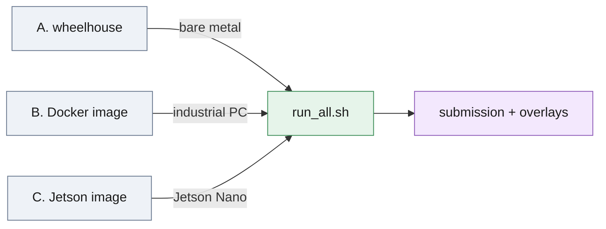

# Deploying on an air-gapped industrial PC



*Three ways to carry the runtime onto a machine without internet; all three end in the same `run_all.sh`.*

On a machine with internet, the whole thing is two commands:

```bash
./setup.sh                      # .venv from deploy/requirements-lock.txt (--cpu | --cuda)
./run_all.sh /path/to/release   # submission.json + overlays (+ score.py when GT ships)
```

Verified from a clean clone of the committed tree: `./setup.sh --cpu`
builds a 2.8 GB CPU environment (torch 2.13.0+cpu, open3d 0.19.0,
ultralytics 8.4.120) and the pipeline then reproduces the submitted poses
(23 of 24 within 2 mm and 2° on three test scenes, the odd one the RANSAC
spread). If the interpreter has no `ensurepip` — Debian and Ubuntu split
it into `python3.x-venv` — the script falls back to `uv` or `virtualenv`
and says so.

Inference needs a Python 3.12 environment, the repo (`src/`, `scripts/`,
`score.py`, `visualize.py`, `run_all.sh`), the two segmenter weights
(`weights/`, 101 MB) and the release folder (`model/` + scenes). It makes no
network request and downloads nothing at run time. Three ways to carry that
onto a machine without internet:

## A. Wheelhouse (bare metal, no Docker)

On a machine *with* internet, same OS family / architecture / Python as the
target (the lock was frozen on Linux x86_64, CPython 3.12):

```bash
pip download -r deploy/requirements-lock.txt -d wheelhouse \
    --index-url https://download.pytorch.org/whl/cpu \
    --extra-index-url https://pypi.org/simple      # CPU torch: 97 wheels, 0.9 GB
# GPU target: drop the two --index-url lines (PyPI torch + CUDA runtime,
# installed size ~4.5 GB more than the CPU flavour)
```

Copy `wheelhouse/` together with the repo and `weights/`; on the target:

```bash
python3.12 -m venv .venv
.venv/bin/pip install --no-index --find-links wheelhouse -r deploy/requirements-lock.txt
./run_all.sh /path/to/release            # or WORKERS=2 ./run_all.sh ... on a small CPU
```

`deploy/requirements-lock.txt` is the exact closure of the runtime imports
(numpy, opencv-python, matplotlib, trimesh, scipy, open3d, ultralytics,
torch, torchvision); the CUDA flavour resolves the CUDA runtime from
torch's own exact pins (listed in the file's header). Only the wheelhouse
step needs internet.

## B. Docker image

```bash
docker build -f deploy/Dockerfile -t pose-est:cpu .     # needs internet, ~5 min
docker save pose-est:cpu | gzip > pose-est-cpu.tar.gz   # 1.24 GB compressed
# ... carry the file over ...
docker load < pose-est-cpu.tar.gz
docker run --rm --network none \
    -v /path/to/release:/data:ro -v "$PWD/out:/out" pose-est:cpu /data test /out
```

`python:3.12-slim-bookworm` + CPU torch, image 1.24 GB (4.9 GB unpacked).
The entrypoint is `run_all.sh` (arguments: release, split, output dir);
`--entrypoint python` runs `scripts/run_pipeline.py` directly. The build
context is the repository root, so keep datasets, `.venv` and training runs
out of it with a `.dockerignore` (`.venv`, `train`, `test`, `seg_data`,
`seg_runs*`) — the image only copies `src/ scripts/ weights/ score.py
visualize.py run_all.sh`. `--network none` is not a courtesy: it is how the
image was verified (below), and it is how it should run in production.

## C. Jetson / ARM

`deploy/jetson-nano/` carries a pin set and a Dockerfile for the original
Jetson Nano 4 GB (JetPack 4.6, Ubuntu 18.04, glibc 2.27, aarch64): Python
3.8 (the stock 3.6 is too old for ultralytics), **open3d 0.18.0** — 0.19
publishes no aarch64 wheel at all — torch 2.4.1 aarch64 CPU, and the same
`run_all.sh` entry point. The pipeline runs on Python 3.8 / open3d 0.18
(x86 container, poses identical to the submission); the arm64 image builds
on the x86 development machine (`--platform linux/arm64`), runs under
qemu-user emulation there, and was then carried to a real board with
`docker save` and measured on it — JetPack 4.6 / L4T R32.7.6, Docker
20.10, MAXN, CPU only ([`../results/bench/board_nano640.json`](../results/bench/board_nano640.json)):
a pick takes 2.6–2.7 s per scene on the board profile
(`config.nano.json`: one segmenter, `imgsz` 640, pick mode; 3 scenes ×
3 repeats), peak RSS 624 MB, one-off model load 23.6 s, and the poses
agree with the x86 run to 0.04 mm / 0.14°. The emulated figure (20.9 s,
[`../results/bench/emulated_nano640.json`](../results/bench/emulated_nano640.json))
was an upper bound, 7.7× the board. Still not verified: the CUDA-10.2 torch
path (JetPack 4.6 publishes it for Python 3.6 only, so a community cp38
wheel is needed) and memory headroom with a desktop session running (the
board was measured headless). See
[`jetson-nano/README.md`](jetson-nano/README.md) — start with `WORKERS=1`
and pick mode.

## What the runtime touches

- Reads: the release folder (`model/3d_model.ply`, `<split>/<scene>/…`),
  `weights/*.pt`. Writes: the submission JSON, optional labels/overlays.
- Caches: ultralytics writes one `settings.json` under `YOLO_CONFIG_DIR`,
  matplotlib a font cache under `MPLCONFIGDIR`. The image points both (and
  `HOME`) at `/tmp/…`, so it also runs `--read-only --tmpfs /tmp` as an
  unprivileged `--user` (verified: model load + imports as uid 1000).
- Network: none. Verified twice — the pipeline plus `visualize.py` in an
  `unshare -rn` namespace with empty `HOME`/`YOLO_CONFIG_DIR`/`MPLCONFIGDIR`
  (exit 0, no font/model download, only `settings.json` written), and the
  image built from a clean clone of the committed tree, run with
  `--network none` on test scenes 000001/000002/000053 (exit 0, 9 + 5 + 11
  poses, 25 of 27 within 0.03 mm / 0.15° of `submission.json`; the other
  two are the RANSAC run-to-run spread the report documents).
- Env vars honoured by this ultralytics (8.4): `YOLO_OFFLINE=1` skips its
  DNS reachability probe and usage events, `YOLO_AUTOINSTALL=0` forbids
  `pip install` attempts, `yolo settings sync=False` turns telemetry off
  in the settings file; the image sets all three. `OMP_NUM_THREADS` caps
  Open3D threads per worker (`run_pipeline.py` derives it from `--workers`
  when unset); `WORKERS` is read by `run_all.sh`.
- Not touched: CUDA (auto-detected; absent on the CPU image), the training
  code paths (`scripts/eval_seg_folds.py`, `render_synthetic.py`).

## Hardware guidance

| Setting                                   | Measured                                             |
| ----------------------------------------- | ---------------------------------------------------- |
| Desktop GPU (RTX 4070 Ti SUPER), 6 workers | 40 test scenes in 135 s (147 s incl. overlays); pick mode, 1 worker: 0.7 s/scene |
| CPU only, Docker image, 2 workers, 20-thread host busy with other jobs | 8–10 s per light scene (000001: 9.9 s, 000002: 8.4 s), 15–36 s per busy pile; all 40 test scenes + overlays via `run_all.sh` in 7 min 10 s wall (mean 20 s/scene, 800 s summed); container peaked at 1.8 GB RAM |
| CPU only, full test split, quiet machine (`analysis/runtime.md`) | 6 workers: 40 scenes in 160 s wall (mean 21.8 s/scene, max 60 s); 2 workers: 280 s wall (mean 13.4 s/scene, max 34 s); pick mode, 1 worker: 1.8 s mean / 2.4 s max per scene (10 scenes), 1.6 s mean on 4 P-cores; 1.6 GB peak RSS per worker |

Per-scene time scales with the number of proposals (each mask costs one
RANSAC/ICP/verify chain) on top of the two segmenter passes; the GPU
accelerates only the segmenters, registration and verification are CPU
work (Open3D/NumPy). Memory: ~1 GB per worker. For an industrial PC
without GPU plan on 4+ physical cores; `pick` mode (below) needs a
fraction of the scene time.

## Integration

- `deploy/live_adapter.py`: `scene_from_arrays(rgb_bgr, depth_u16, K,
  depth_scale)` wraps one registered RGB-D frame from any camera SDK,
  `estimate_scene(scene, model_cloud, seg, extra, pick=False)` returns
  `[{R, t, score}]` best first — the same objects and calls as
  `scripts/run_pipeline.py`. Load models once per process (`load_models`).
- **Pick mode.** `pick=True` stops at the first pose scoring ≥ 0.8
  (segmenter confidence × depth verification) — one confident pick per
  cycle, then grab and rescan; a bin changes after every pick, so a full
  ranking is wasted work. On the desktop GPU a pick returns in 0.7 s on
  average where the full sweep takes 12 s per scene
  (`analysis/runtime.md`). `deploy/pick_demo.py` runs exactly this path on a
  scene folder (arrays in, grasp pose out) — the check to run on a new
  machine or after a recalibration. Gate on `score`: ≥ 0.7 keeps precision
  0.99 at 5 mm on cross-validated train scenes, ≥ 0.6 keeps 0.96 at 10 mm
  (0.94 at 5 mm; `analysis/score_calibration.md`).
- **Failure handling.** `run_pipeline.py` already isolates scenes: an
  exception yields an empty list for that scene, never a crash. For a cell:
  wrap each cycle in a watchdog (a scene should never exceed ~60 s on the
  target; kill and rescan), treat "no pose ≥ gate" as *rescan/shake the
  bin*, not as an error, and log `score` + the number of proposals per
  cycle — a sustained drop in verified detections is the domain-shift
  signal that triggers the geometric safety net inside the pipeline and
  should also trigger a recalibration check outside it.
