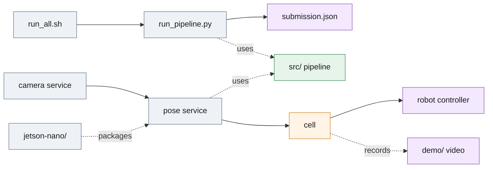

# deploy/ — the pipeline packaged for a cell

`deploy/` runs the same `src/` pipeline that [`run_all.sh`](../run_all.sh) runs for the submission, packaged the way it would run in a bin-picking cell: a camera service, a long-lived pose service, a cell layer that turns a pose into a pick, and the board packaging for a Jetson Nano. Nothing here forks the estimator: `pose_service/service.py` calls the same `detect_scene_hybrid` and `PoseEstimator` as `scripts/run_pipeline.py`.



*Batch and cell paths use the same `src/` estimator; `jetson-nano/` packages the pose service for the board, `demo/` records the cell loop.*

## Run the cell on a laptop

Environment from [`../setup.sh`](../setup.sh); the release folder (`model/`, `test/`) unpacked at the repository root, as `./run_all.sh .` expects. Three terminals:

```bash
# 1 — camera: replays the test split as a frame stream on 127.0.0.1:8081
.venv/bin/python -m deploy.camera_service.server
# 2 — vision: the board profile (one segmenter, 640 px, pick mode) on 127.0.0.1:8080
.venv/bin/python -m deploy.pose_service.server --config deploy/jetson-nano/config.nano.json
# 3 — one cycle: frame -> poses -> grasp -> decision, one JSON line
.venv/bin/python -m deploy.cell.runner --once
```

Both services take a JSON config file (`--config`) and `CAM_*` / `POSE_*` environment overrides; a release elsewhere is `CAM_ROOT=<release>` for the camera and `POSE_CAD_PATH=<release>/model/3d_model.ply` for the pose service. Without `--config` the pose service runs the shipped two-segmenter configuration. `deploy.cell.runner --cycles 0` loops until interrupted; a PICK is logged, not executed (no robot is attached).

## On the board

`jetson-nano/` holds the aarch64 Dockerfile, the pinned wheels, the board profile `config.nano.json`, the systemd unit and the bench and acceptance scripts; the bring-up order from a flashed SD card to a first pick is [jetson-nano/README.md](jetson-nano/README.md). The image is built on an x86 host with `--platform linux/arm64` and carried over with `docker save`.

## What is where

| Path | What it is | Details |
| ---- | ---------- | ------- |
| `camera_service/` | frames as a service: `/v1/frame`, `/v1/intrinsics`, `/preview.mjpg`; sources scene folder, recorded session, RealSense | [camera_service/README.md](camera_service/README.md) |
| `pose_service/` | the estimator as a service: `/v1/estimate`, `/healthz`, `/readyz`, `/metrics`; score = segmenter confidence × depth verification, gate 0.7 | [pose_service/README.md](pose_service/README.md) |
| `cell/` | pose to pick: grasps in the CAD frame, hand-eye calibration, drift monitor, pick policy, the cell loop (`runner.py`) | [cell/README.md](cell/README.md) |
| `demo/` | records the cell loop as an annotated MP4 and a contact sheet, live or from a cycle log | [demo/README.md](demo/README.md) |
| `jetson-nano/` | board packaging: Dockerfile, wheel pins, `config.nano.json`, systemd unit, `bench.py`, `accept.sh`, `cell_demo.py` | [jetson-nano/README.md](jetson-nano/README.md) |
| `live_adapter.py` | `scene_from_arrays` + `estimate_scene`: one RGB-D frame from any camera SDK into the pipeline | module docstring |
| `pick_demo.py` | one pick cycle on a scene folder, in-process, no camera — the check for a new machine | module docstring |
| `Dockerfile` | CPU-only x86 image, entrypoint `run_all.sh`, runs with `--network none` | [OFFLINE.md](OFFLINE.md) |
| `requirements-lock.txt` | exact closure of the runtime imports (Linux x86_64, CPython 3.12) | [OFFLINE.md](OFFLINE.md) |
| `OFFLINE.md` | wheelhouse, Docker image and Jetson image for an air-gapped machine; what the runtime touches | — |
| `ARCHITECTURE.md` | why camera, vision and decision are three processes; the pick policy | — |

## Measured on hardware

| Machine | Configuration | Pick latency | Peak RSS | Record |
| ------- | ------------- | ------------ | -------- | ------ |
| Desktop, i5-14600K + RTX 4070 Ti SUPER, GPU | shipped: two segmenters, 960 px | 0.7 s mean, 2.1 s max | 1.87 GB per worker | [`../analysis/runtime.md`](../analysis/runtime.md) |
| Jetson Nano 4 GB, JetPack 4.6, Docker 20.10, CPU only, MAXN | board profile: `part-seg-nano.pt`, 640 px | 2.6–2.7 s per scene (3 scenes × 3 repeats) | 624 MB | [`../results/bench/board_nano640.json`](../results/bench/board_nano640.json) |
| qemu-user aarch64 on the desktop, board limits | board profile | 20.9 s (7.7× pessimistic) | 740 MB | [`../results/bench/emulated_nano640.json`](../results/bench/emulated_nano640.json) |

The board profile on the desktop CPU takes 0.29–0.31 s and 1.09 GB ([`../results/bench/native_nano640.json`](../results/bench/native_nano640.json)); the board's poses agree with it to 0.04 mm / 0.14°, and a full 40-scene sweep on the board (329 poses, 34 min, [`../results/board/test_sweep_nano640.json`](../results/board/test_sweep_nano640.json)) matches the x86 run as closely as two x86 runs match each other.

`jetson-nano/cell_demo.py` collapses camera, vision and cell into one process and writes an annotated video; it runs on the desktop and has not yet been run on the board.
