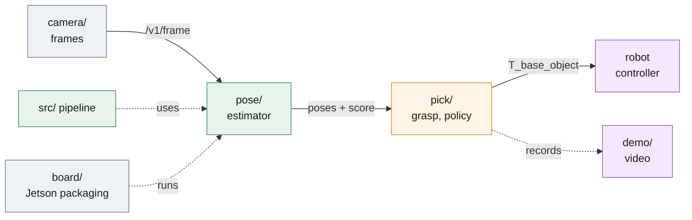

# `deploy/` — the vision cell, as it runs on the Jetson Nano

The same `src/` pipeline that [`run_all.sh`](../run_all.sh) runs for the
submission, packaged the way it runs in a bin-picking cell. Nothing here
forks the estimator: `pose/service.py` calls the same `detect_scene_hybrid`
and `PoseEstimator` as `scripts/run_pipeline.py`. Every folder is one
concern; every file in it is one problem of that concern.



*Five folders, one concern each: frames in, poses out, a pick decided, the loop recorded, the board provisioned.*

| Folder | Concern | Files (one problem each) | Read |
| ------ | ------- | ------------------------ | ---- |
| `camera/` | frames as a service | `frame.py` the wire contract · `sources.py` scene folder, session replay, RealSense · `session.py` lossless RGB-D recording format · `record.py` record a split · `server.py` HTTP · `client.py` · `config.py` | [camera/README.md](camera/README.md) |
| `pose/` | the estimator as a service | `adapter.py` one frame → `Scene` → poses · `models.py` load once · `service.py` estimate + score · `schema.py` request/response · `server.py` HTTP · `client.py` · `config.py` | [pose/README.md](pose/README.md) |
| `pick/` | pose → grasp → action | `frames.py` transforms · `calibration.py` hand-eye · `grasp.py` + `grasps.part.json` · `drift.py` calibration watch · `policy.py` pick / rescan / shake / stop · `runner.py` the loop over the three services | [pick/README.md](pick/README.md) |
| `demo/` | show the loop | `hud.py` draw one cycle · `render_demo.py` MP4 + contact sheet from the services · `cell_demo.py` the same loop in **one process** — meant for the board | [demo/README.md](demo/README.md) |
| `board/` | Jetson Nano 4 GB | `Dockerfile` + pins · `config.nano.json` the board profile · `pose-service.service` · `provision.sh` `preflight.sh` `accept.sh` `uninstall.sh` · `bench.py` `compare_bench.py` `emulate.sh` · runbook and `ACCEPTANCE.md` | [board/README.md](board/README.md) |

Design notes — why three processes, what each owns, the pick policy as a
state machine — are in [ARCHITECTURE.md](ARCHITECTURE.md).

## Run the cell on a laptop

Three terminals, from the repository root with the `.venv` from `./setup.sh`;
the camera replays a recorded session (or a scene folder) so no hardware is
needed:

```bash
# 1. camera: replay sessions/test40 (record one with: python -m deploy.camera.record --root . --split test --out sessions/test40)
CAM_SOURCE=session CAM_ROOT=sessions/test40 .venv/bin/python -m deploy.camera.server
# 2. pose service, board profile
.venv/bin/python -m deploy.pose.server --config deploy/board/config.nano.json
# 3. one cycle, or a loop with a JSONL record
.venv/bin/python -m deploy.pick.runner --once
.venv/bin/python -m deploy.pick.runner --cycles 20 --out out_cell/cycles.jsonl
```

One process, no services, video out — the board demonstration, runnable
anywhere:

```bash
.venv/bin/python deploy/demo/cell_demo.py --root . --split test --scenes 000001 000003 --out out_demo
```

## On the board

`board/README.md` is the runbook from a flashed SD card to a first pick and a
benchmark; `board/ACCEPTANCE.md` says when the board is *right*. The image is
built on an x86 host with `--platform linux/arm64` and carried over with
`docker save`.

## Measured on hardware

| Machine | Configuration | Pick latency | Peak RSS | Record |
| ------- | ------------- | ------------ | -------- | ------ |
| Desktop, i5-14600K + RTX 4070 Ti SUPER, GPU | shipped: two segmenters, 960 px | 0.7 s mean, 2.1 s max | 1.87 GB per worker | [`../analysis/runtime.md`](../analysis/runtime.md) |
| Jetson Nano 4 GB, JetPack 4.6, Docker 20.10, CPU only, MAXN | board profile: `part-seg-nano.pt`, 640 px | 2.6–2.7 s per scene (3 scenes × 3 repeats) | 624 MB | [`../results/bench/board_nano640.json`](../results/bench/board_nano640.json) |
| qemu-user aarch64 on the desktop, board limits | board profile | 20.9 s (7.7× pessimistic) | 740 MB | [`../results/bench/emulated_nano640.json`](../results/bench/emulated_nano640.json) |

The board profile on the desktop CPU takes 0.29–0.31 s and 1.09 GB
([`../results/bench/native_nano640.json`](../results/bench/native_nano640.json));
the board's poses agree with it to 0.04 mm / 0.14°, and a full 40-scene
sweep on the board (329 poses, 34 min,
[`../results/board/test_sweep_nano640.json`](../results/board/test_sweep_nano640.json))
matches the x86 run as closely as two x86 runs match each other.

`demo/cell_demo.py` runs on the desktop and has not yet been run on the
board. The x86 Docker image and the air-gapped wheelhouse that reproduce
the *submission* are not part of the cell: [`../Dockerfile`](../Dockerfile),
[`../requirements-lock.txt`](../requirements-lock.txt),
[`../docs/offline-install.md`](../docs/offline-install.md).
