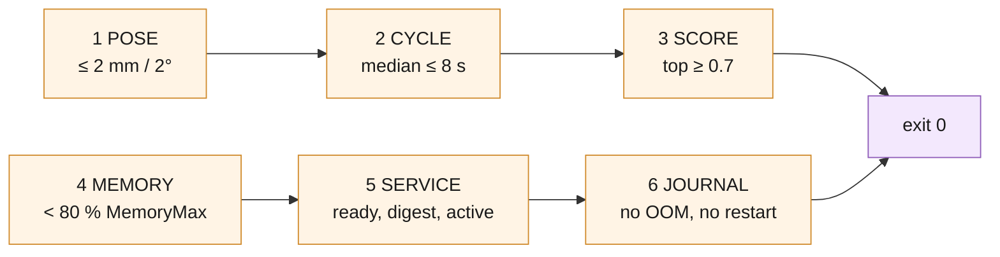

# When is the board working?

`deploy/board/README.md` gets a Nano from a flashed SD card to a
service that answers. This file is the other half: the measurable statement
that the board is *right*, the thresholds that statement is made of, where
each number comes from, and what to do when one of them fails.



*The six gates `accept.sh` prints in `summary.txt`, each with its pass condition, all six for `exit 0`; POSE is the only correctness claim, the rest say the board is in the state that was measured.*

`deploy/board/accept.sh` collects the evidence. Run it after
provisioning, after a board swap, after a recalibration, and after any change
to `config.nano.json` or `weights/`:

```bash
deploy/board/accept.sh pose@<board-ip>            # defaults below
deploy/board/accept.sh pose@<board-ip> \
    --prefix /opt/pose-estimation --release /opt/pose-estimation \
    --scenes "000001 000002 000015" --out out_board
```

It leaves nine files in `--out` (default `out_board/`) and prints
`summary.txt` to the terminal. Send the whole directory back; `summary.txt`
is the page to read first, and every line on it is defended below.

| File | What it settles |
| --- | --- |
| `board.json` | `bench.py` on the board, board profile, three repeats — the timings, the peak RSS and the poses themselves |
| `compare-board.txt` | `board.json` against `results/bench/board_nano640.json` — **a Jetson Nano 4 GB that was actually measured**, same JetPack, same profile. The comparison that matters |
| `compare-emulated.txt` | `board.json` against `results/bench/emulated_nano640.json` — the aarch64 stack's own answer |
| `compare-native.txt` | `board.json` against `results/bench/native_nano640.json` — the x86 development machine's answer |
| `service.json` | `/healthz`, `/readyz`, `/metrics`, the unit's state, and the config digest that produced them |
| `env.txt` | what the board *is*: device tree, L4T, kernel, packages, RAM and swap, clocks, thermals before and after the bench |
| `journal.txt` | the service journal tail plus any kernel OOM line — a restart the numbers alone would hide |
| `bench.log` | everything `bench.py` printed while it ran, including the failure when it did not finish |
| `summary.txt` | the six gates, pass or fail, with the numbers |

Exit codes: `0` everything collected and every gate passed, `1` collected but
a gate failed, `2` nothing to judge (board unreachable, files missing, the
benchmark died).

---

## The six gates

### 1. POSE — the pass/fail

**Threshold: every compared scene agrees within 2 mm and 2 degrees, with no
pose present on one side only.**

Where it comes from: `compare_bench.py`'s `DEFAULT_MAX_MM` / `DEFAULT_MAX_DEG`,
and they are that size for a reason — the depth channel is quantised to 1 mm
and the pipeline's own in-plane floor is about 2 mm, so a tighter tolerance
would be measuring noise rather than the port. `compare_bench.py` exits
non-zero when it fails, and `accept.sh` gates on that exit code, not on a
number it re-derives.

This is the only gate that is a *correctness* claim. An aarch64 build of
Open3D, a CPU torch wheel and a different BLAS have to land the pose the
development machine lands. If they do, the board is running the system that
was validated; if they do not, nothing else on the page matters.

Three baselines are compared, and the first is the one to read:
`results/bench/board_nano640.json` is a Jetson Nano 4 GB on JetPack 4.6 —
same silicon, same JetPack, same profile — so a second board is judged
against the first rather than against a desktop. A board that agrees with it
to well inside 2 mm is running the same system. The emulated and x86 records
say the same thing from further away, and they are kept because they are the
records the port was originally proved against.

Read the `NOISE` line next to it. RANSAC is stochastic — its OpenMP threads
share one random engine — so repeats of one scene differ on one machine. A
cross-machine delta below the same-machine spread is not a port defect. With
`--repeat 3` that spread is always measured.

**When it fails**

- *`n pose(s) present on one side only`* — the board found a different number
  of instances. Check `board.json`'s `proposals` count against the baseline's:
  a collapse there is the segmenter, not the geometry. First suspect is the
  wrong weight file — confirm `config.seg_model` in `board.json` reads
  `part-seg-nano.pt` and `config.extra_seg_model` is `null`.
- *`X mm > 2.0 mm`* with poses matched — a real numerical difference. Compare
  `host.versions` in `board.json` against
  `results/bench/emulated_nano640.json`: the board is supposed to be on
  torch 2.4.1 / open3d 0.18.0 / numpy 1.24. A different Open3D draws RANSAC
  differently, and that is the first thing to rule out.
- *`the two runs were not asked the same question`* — `compare_bench.py`
  refuses to compare records that disagree on `split`, `pick`, `imgsz`,
  `profile` or the segmenter set, and says which. Nothing is wrong with the
  board; the run was misconfigured. `accept.sh` passes the board profile
  explicitly for exactly this reason, so a mismatch means the *baseline* or
  the config moved.

### 2. CYCLE — the time one pick takes

**Target: the slowest scene's median wall time inside 4–8 s.**

Where it comes from: the robot, not this repository. A bin-picking cell hides
the vision step inside the robot's own motion, and 4–8 s per pick is the
budget this cell is being built to. `docs/offline-install.md` puts the cell's
watchdog upper bound at **~60 s** — the point at which a cycle is a hang, not
a slow frame.

**A Cortex-A57 has been timed.** `results/bench/board_nano640.json` is a
Jetson Nano 4 GB developer kit on JetPack 4.6 (L4T R32.7.6), MAXN, headless:
**2.6–2.7 s a pick** on this profile, with a one-off 23.6 s model load — 9x
the same profile on x86 and comfortably inside the budget. So this gate now
*confirms* a number rather than establishing one, and `summary.txt` prints
this run's multiple of that 2.7 s beside the verdict.

The gate itself is still the 4–8 s budget, because that is what the cell
requires; the reference is what tells you *why* a board is at 6 s. Above
**1.5x** the reference `summary.txt` says so in `worth acting on`, even while
the gate passes: the board record's own repeat spread is ~2 %, so 1.5x is not
noise — it is a board in a different state.

**When it is over budget, or over 1.5x the reference**

In the order to reach for them:

1. Confirm the board was actually clocked. `env.txt` carries `nvpmodel -q`
   and the CPU scaling frequencies. Without `sudo nvpmodel -m 0` and
   `sudo jetson_clocks` the timings are meaningless — this is the single most
   common cause of a slow first run.
2. Confirm the board is headless. `sudo systemctl set-default
   multi-user.target` returns the RAM and the cores the desktop session
   holds.
3. Read the stage split in `board.json`. `stages_s_min` names where the time
   went. If it is `register`, the two nano knobs in the runbook's *Resource
   budget* do not help — registration is ~85 % of scene time and is already
   OpenMP-parallel across the four cores. If it is `segmenter`, `seg_imgsz`
   is the lever, and it is a cheap one (960 → 640 costs 0.002 AR).
4. Check `journal.txt` and the `Swap` line in `env.txt`. A cycle that swapped
   is not a slow cycle, it is a different failure — see MEMORY.

### 3. SCORE — the cell would actually pick

**Threshold: every returned top score at or above the 0.7 accept gate; at or
above 0.8 is a clean pick.**

Where it comes from: `analysis/score_calibration.md`. `score` is segmenter
confidence × depth verification, and on leave-scenes-out cross-validation
`score >= 0.7` carries ~0.99 precision at 5 mm and 0.99 at 10 mm, at recall
0.786. 0.6 buys recall back (0.872 at 10 mm) for precision 0.94 at 5 mm;
below 0.4 a prediction is wrong more often than right. Read it as a rank, not
a probability — it is only roughly calibrated (ECE 0.143) and its ranking is
what is trustworthy (AUROC 0.94 against correct-at-5-mm).

The two thresholds are different on purpose. Pick mode stops the sweep at the
first pose scoring ≥ 0.8 (`pick_score` in `config.nano.json`); the cell
accepts at 0.7 (`accept_score`). So a normal cycle returns one pose well
above the gate, and a score *between* 0.7 and 0.8 means the sweep ran to the
end without finding a clean one — it still picks, but the margin is thin.
`accept.sh` reports that as a WARN, because the single-segmenter board
profile is expected to produce it occasionally: `analysis/nano_profile.md`
measures the worst CV scene's best score falling from 0.854 to 0.812 when the
second segmenter is dropped.

**When it fails**

A score under 0.7 on a *recorded* scene the development machine scores at
0.85 is not a threshold problem, it is a different pipeline: check the
weights, the CAD model and the library versions in `board.json`. A low score
on a *live* frame is the cell working as designed — rescan, then shake the
bin (runbook, *Operating the cell*). Count the rate; the rate is the signal,
not the event.

### 4. MEMORY — it fits, with room

**Threshold: bench peak RSS under 80 % of the unit's `MemoryMax`. Between
80 % and 100 % is a warning; over is a failure.**

Where it comes from: `pose-service.service` sets `MemoryMax=2600M`, and
`accept.sh` prefers the value `systemctl show` reports for the *running*
unit — a board with a site override in `/etc/default/pose-service` is judged
against what it actually enforces, not against what the file in the repo
says.

What to expect: **624 MB**, measured — that is what the same profile peaked
at on the board (`results/bench/board_nano640.json`), against 0.74 GB
emulated and 1.09 GB on x86, and it leaves the 2600 MiB cap a factor of four.
The service holding the profile across frames measured 0.95 GB after load and
1.71 GB RSS on x86. So a board figure near 0.6–0.8 GB is the expectation, and
anything near 2 GB deserves an explanation before the cell is trusted.

`summary.txt` computes the percentage in MiB on both sides: systemd reports
`MemoryMax` in bytes and its `M` suffix means MiB (`MemoryMax=2600M` is
2726297600), while `bench.py`'s `peak_rss_mb` is `ru_maxrss/1024`. Mixing the
two flatters a board near the cap by about 5 %.

Note what the bench figure is *not*: it is one worker's peak while the
service was also running and holding its own models. That is the board's real
condition, not an idle-board best case, and `summary.txt` prints the
service's own `MemoryCurrent` beside it so the two are not confused.

**When it fails**

- The unit is not being throttled but killed: JetPack 4.6 is systemd 237 and
  cgroup v1, where `MemoryMax` maps to `memory.limit_in_bytes` and
  `MemoryHigh` is silently ignored. There is no soft-throttle path. Check
  `journal.txt` for the kill.
- Add swap before raising the cap: 2 GB of file swap on top of zram is the
  envelope `emulate.sh` reproduces and the runbook documents. Swap is
  insurance, not headroom — a cycle that actually swaps blows the latency
  budget — but degrading is better than dying.
- Then look at the profile: the two nano knobs (one segmenter, lower
  `seg_imgsz`) are priced in `analysis/nano_profile.md`. Activation memory
  falls with the square of `imgsz`.
- Raising `MemoryMax` is the last move, not the first: the cap exists so a
  leak takes the service down instead of the board.

### 5. SERVICE — the cell can talk to it

**Threshold: `/healthz` answers 200 with `ready: true`, `/readyz` and
`/metrics` answer 200, the digest the service is running matches the config
file on disk, and systemd reports the unit `active`.**

Where it comes from: `deploy/pose/server.py`. The service binds its
socket before it imports the estimator, so an open port is not readiness —
`/healthz` is, and it returns 503 with `"status": "starting"` then
`"loading"` until the CAD cloud and the segmenter are in memory and the
warmup inference has run. That is seconds on a desktop and minutes on four
A57-class cores.

The digest is the provenance link. Every setting in `config.nano.json` is
hashed into a short digest that comes back with every pose, which is how a
pick made months ago is traced to the weights and thresholds that moved the
robot. The digest covers *resolved absolute* paths, so a board that unpacks
the release somewhere else carries its own digest legitimately; what matters
is that it does not change between two picks.

**When it fails**

- *`/healthz` did not answer* — the unit is down or bound somewhere else.
  `journal.txt` has the reason. Five failed starts in five minutes leaves the
  unit `failed` on purpose (`StartLimitBurst=5`): a missing weight file or a
  bad config must stop loudly rather than restart forever.
- *200 but `ready: false`* — it is still loading. Re-run `accept.sh` once
  `/healthz` reports ready; the runbook has the poll loop.
- *answering, but the unit is `inactive/dead`* — something is serving on the
  port that systemd did not start. Every probe passes and the cell works
  today; the next reboot leaves the board silent. Usually a hand-started
  process from bring-up that was never replaced by `sudo systemctl enable
  --now pose-service`. Kill it, enable the unit, re-run.
- *digest mismatch* — the config file changed after the service started, or
  `/etc/default/pose-service` overrides a setting the file does not carry
  (`POSE_SEG_IMGSZ`, `POSE_HOST`, …). Both are legitimate; neither may be
  left unexplained, because it means `service.json`'s config block is not the
  configuration that produced the poses. `sudo systemctl restart
  pose-service` and re-run to settle it.

### 6. JOURNAL — nothing was hidden

**Threshold: no OOM kill, no restart, no traceback in the tail, and
`NRestarts` at zero.**

Where it comes from: the numbers alone cannot see a service that died and
came back between two scenes. A restart resets the model load, the counters
and the memory picture, and a bench that straddles one is not measuring one
process. The journal is also the only place the kernel's OOM killer speaks.

**When it fails**

Read the lines `summary.txt` quotes. `Killed process` or `out of memory` is
the MEMORY gate in disguise — go there. `Scheduled restart` with
`NRestarts > 0` means the unit crashed during or before the run: everything
above it was measured on a service that is not stable, and the acceptance
run should be repeated after the crash is fixed.

---

## What this run cannot tell you

State these plainly whenever the artefacts are quoted:

- **One board has been measured, and it is not necessarily this one.**
  `results/bench/board_nano640.json` is a single Jetson Nano 4 GB, measured
  headless at MAXN with the dataset on local storage, running the stack
  inside Docker. A second board with a slower SD card, a desktop session up,
  a different power model or a warmer enclosure is a different machine, and
  the reference tells you *how far off* it is, not that it is broken. Treat a
  surprising number as information about this board until the stage split
  says otherwise.

- **The emulated record is an upper bound, not an estimate.** qemu-user
  emulates the ARMv8 instruction set, not a Cortex-A57: there is no A57 cache
  hierarchy behind it, no LPDDR4 bandwidth, no thermal envelope, and qemu's
  own translation overhead dominates. It inflates the shipped board profile
  71x overall and does it unevenly — **541x on the segmenter against 14x on
  registration** — so no single scaling factor carries from it to the board.
  `compare_bench.py` reports the ratio without a verdict for that reason, and
  `summary.txt` repeats it. What the emulated run *does* prove is that the
  aarch64 build returns the same poses, which is why it is the left-hand side
  of the POSE gate.

- **Three scenes and three repeats is not a shift.** It is enough to
  establish the cycle time and to catch a gross regression. Thermal
  throttling, memory fragmentation over hours and the failure rate on live
  bins all need the cell running, not a benchmark. `env.txt` records the
  thermals before and after so a board that is already hot after three picks
  is at least visible; the Nano throttles near 87 °C.

- **The dataset is recorded, not live.** A pose that is right on
  `test/000001` says the pipeline and the port are right. It says nothing
  about the camera's intrinsics or its depth scale, which is the other half
  of a working cell and the failure that looks most like a broken model.
  `deploy/demo/cell_demo.py --scenes <scene> --no-video` on a recorded scene separates the two.

- **The GPU is untouched.** JetPack 4.6 ships CUDA torch for Python 3.6 only,
  so the shipped pins are CPU. It is worth little here — the GPU accelerates
  only the segmenters, which are ~2 % of scene time — but no number in these
  artefacts describes a CUDA build.

---

## Before the first run

The acceptance numbers are only as good as the board's state when they were
taken. From the runbook, in this order:

```bash
sudo nvpmodel -m 0        # MAXN: all 4 A57 cores
sudo jetson_clocks        # pin CPU/GPU/EMC clocks -- timings mean nothing without it
sudo systemctl set-default multi-user.target && sudo reboot   # headless
swapon --show             # zram, plus the 2 GB file swap if the desktop stays
systemctl is-active pose-service
```

`env.txt` records all of it, so a run taken on an unclocked board can be
recognised afterwards rather than argued about.

## What the script may delete

`accept.sh` writes exactly one directory on the board, `<prefix>/out_accept`,
and holds `board.json` in it. Nothing is removed unless `--clean` is passed,
and `--clean` prints the path first and refuses any path that does not
resolve inside the install prefix. A prefix that is itself a system root
(`/`, `/usr`, `/opt`, `/home`, …) is refused before the script connects.
Everything else on the board is read.
