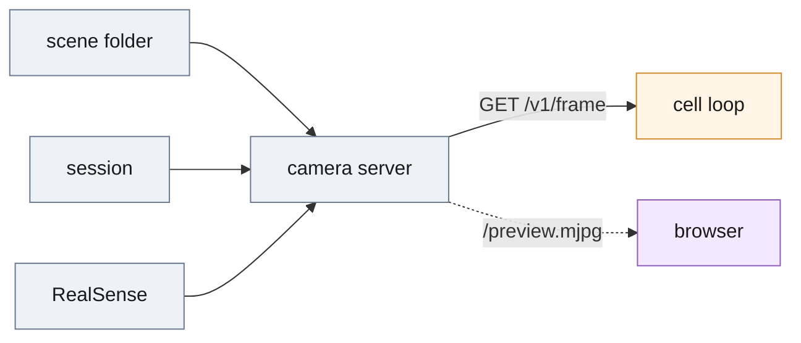

# Camera service

Serves one registered RGB-D frame per request, from recorded scenes, a recorded session or a RealSense, so nothing downstream can depend on where the pixels came from.



*One source per process; frames are pulled one per request, and the preview re-serves the last frame the cell took rather than taking its own.*

## Run

```bash
CAM_SOURCE=session CAM_ROOT=sessions/test40 .venv/bin/python -m deploy.camera_service.server   # replay a recorded session
.venv/bin/python -m deploy.camera_service.server                                               # replay ./test, looping (the default)
.venv/bin/python -m deploy.camera_service.record --root . --split test --out sessions/test40 --fps 2   # record a split as a session
.venv/bin/python -m deploy.camera_service.client info                                          # intrinsics and source state
```

Every `CameraConfig` field ([config.py](config.py)) comes from `--config file.json` or a `CAM_<FIELD>` variable; the default bind is `127.0.0.1:8081`, and `--once` answers one request and exits.

## Interface

| Route | Returns |
| --- | --- |
| `GET /v1/frame` | next frame: `rgb_png_b64`, `depth_png_b64`, `K`, `depth_scale`, `frame_id`, `timestamp_ns`, `source` |
| `GET /v1/intrinsics` | `K`, `depth_scale`, width, height, without consuming a frame |
| `GET /preview.mjpg` | colour frames as MJPEG; `GET /` wraps it in a page |
| `GET /healthz`, `/readyz`, `/metrics`, `/stats` | 200 once the source is open / once a frame has been read; Prometheus text; the same counters as JSON |
| status codes | 503 not ready or not delivering, 410 a finite replay ended, 404 no such route |

## Files

| File | Role |
| --- | --- |
| [server.py](server.py) | HTTP transport, health, metrics, MJPEG preview |
| [sources.py](sources.py) | `FrameSource`: scene-folder replay and the RealSense driver (untested, no device was available) |
| [session.py](session.py) | session format: `session.json` sidecar plus FFV1 lossless `color.mkv` and `depth.mkv` (16-bit depth as two 8-bit planes) plus a lossy `preview.mp4`; the PNG served from a replay is byte-identical to the one served from the release folder on all 40 test scenes |
| [record.py](record.py) | record a split as a session, then read it back and verify it |
| [frame.py](frame.py) | `Frame` and its wire form, the body `POST /v1/estimate` accepts |
| [config.py](config.py) | `CameraConfig`, validated at startup |
| [client.py](client.py) | CLI: `info`, `grab` (writes a scene folder), `stream` |
