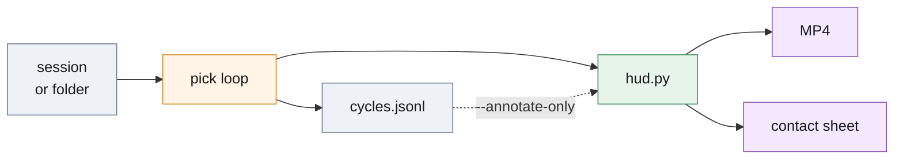

# `demo/` — show the loop

Records the cell running as an MP4 of held frames plus a contact sheet; each frame is the released overlay with a side panel showing the score, the gate, the decision and the latency.



*Live, the renderer drives the runner's loop and records it; from a log, it re-draws the same cycles without a camera, a pose service or the pipeline.*

## Run

```bash
# live: camera and pose services up (see ../ARCHITECTURE.md), 8 cycles
.venv/bin/python -m deploy.demo.render_demo --cycles 8 --out out/demo.mp4 --log out/cycles.jsonl --sheet out/sheet.png
# again, from the log: --frames is the folder that holds the scenes the log names
.venv/bin/python -m deploy.demo.render_demo --annotate-only --log out/cycles.jsonl --frames test --out out/demo.mp4 --sheet out/sheet.png
```

`--hold` seconds per cycle (1.5; `0` holds each for the wall-clock it took), `--fps` 10, `--codec mp4v` (`avc1` where OpenCV has an H.264 encoder), `--sheet-n`/`--sheet-cols` for the sheet, `--scenes` to filter a re-render, `--hardware`/`--bench` to name the machine that estimated the frames when re-rendering a board run.

## What the panel shows

| Block | Fields |
| --- | --- |
| header | cycle, bin, scene, frame id, source |
| VISION | poses from proposals, top score, the service's gate, a score bar with the cell's own gate as a tick |
| DECISION | policy state and its reason |
| GRASP | chosen grasp name and type, pose index, rank, clearance, position in the camera frame and in the base frame (or "no hand-eye given") |
| LATENCY | cycle ms and bars per stage: camera, decode, estimate, segment, register, plan |
| CELL | picks this bin, rescans/shakes/failures since progress, pick outcome, drift verdict, config digest, hardware line |

Silhouettes come from `score.silhouette` and axes from `visualize.py`'s convention, so a demo frame and an `overlays_test/` image are the same drawing of the same pose; the chosen instance is magenta. Rendering is cv2 only, so it runs on the board.

One-process variant for the board: [cell_demo.py](cell_demo.py) collapses camera, pose service and pick layer into one interpreter and writes `cell_demo.mp4`, `cycles.jsonl` and `summary.json` as it goes. It has not been run on the Jetson Nano yet (the board was offline when it was written); the board numbers in [../board/README.md](../board/README.md) come from `bench.py`, which runs the pipeline without a HUD.

## Files

| File | Role |
| --- | --- |
| [render_demo.py](render_demo.py) | `DemoVideo` and the contact sheet; live or `--annotate-only` |
| [hud.py](hud.py) | `FrameHud`, `HudFrame`, `hardware_line`: one cycle drawn |
| [cell_demo.py](cell_demo.py) | the same loop in one process — camera, estimator, planner, policy and HUD in one interpreter; writes `cell_demo.mp4`, `cycles.jsonl`, `summary.json` (`--no-video` for a first-pick check) |
