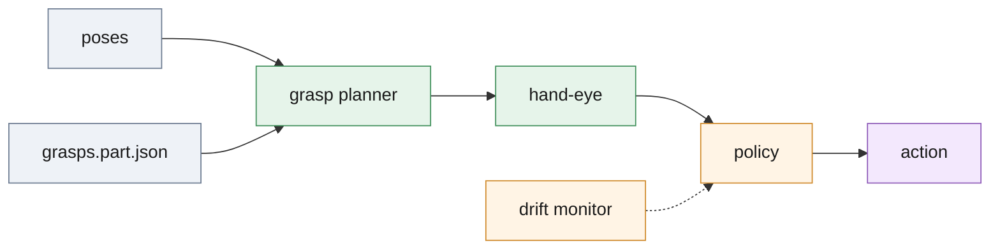

# `pick/` — pose to pick

Turns the poses the service returns into a decision a robot controller can act on: which grasp, in which frame, and whether to pick, rescan, shake or stop. Nothing here estimates a pose and nothing here moves a robot.



*One cycle: rank grasps on the verified poses, move the chosen one into the robot frame, let the state machine decide; the drift verdict can veto.*

## Run

```bash
.venv/bin/python -m deploy.pick.runner --once                                    # one cycle against the two local services
.venv/bin/python -m deploy.pick.runner --camera http://127.0.0.1:8081 --pose http://127.0.0.1:8080 --cycles 5 --out cycles.jsonl
.venv/bin/python -m deploy.pick.policy                                           # simulated state sequence; every module has such a self-check
```

`--cycles 0` runs until interrupted; `--hand-eye file.json` adds the base-frame grasp pose (without it grasps are reported in the camera frame only); `--accept-score` (0.7) is the cell's own gate; `--pick-outcome` defaults to `unknown` because no pick is executed; `--stop-on-terminal` exits at `empty` or `fault`.

## Interface

`runner.py` appends one JSON object per cycle to `--out`: `ts`, `cycle`, `bin`, `loop`, `frame`, `scene`, `n_poses`, `n_proposals`, `gate`, `top_score`, `state`, `reason`, `drift`, `outcome`, `grasp`, `poses`, `stage_ms`, `service_ms`, `config_digest`, `history`, `error`, `backoff_s`. It carries the poses and the intrinsics so a cycle can be re-drawn from the log ([../demo](../demo/README.md)).

| Policy state | Meaning |
| --- | --- |
| `scan` | look at the bin; a viable grasp goes to `pick`, or to `retry` after a failure |
| `pick`, `retry` | execute the top grasp; the controller reports `success`, `slip` or `miss` |
| `shake` | disturb the bin, then scan again |
| `empty`, `fault` | terminal: shake budget spent with nothing proposed / with parts present but nothing verified, or drift verdict `recalibrate` |

Frames: `T_base_object = T_base_camera @ T_camera_object`, checked by name at run time ([frames.py](frames.py)). Grasps: `T_object_grasp` per grasp in the CAD frame, metres ([grasps.part.json](grasps.part.json): two suction, three parallel).

## Files

| File | Role |
| --- | --- |
| [frames.py](frames.py) | rigid transforms with frame names attached; composition refuses mismatched frames |
| [calibration.py](calibration.py) | hand-eye solve (`fixed` or `wrist` mount) with residuals; a solve outside budget is flagged unusable |
| [grasp.py](grasp.py) | `GraspPlanner`: grasps ranked by score, top-of-pile and approach clearance against the depth map |
| [grasps.part.json](grasps.part.json) | measured grasp definitions on the part |
| [drift.py](drift.py) | `DriftMonitor`: per-axis medians of pick corrections, per-shift trend, verdict `ok`, `watch` or `recalibrate` |
| [policy.py](policy.py) | `PickPolicy`: the state machine above |
| [runner.py](runner.py) | the loop: camera, pose, grasp, policy, one JSON line per cycle |
