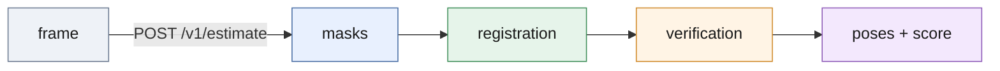

# Pose service

Holds the CAD cloud and the segmenter weights for the life of the process and answers one RGB-D frame with ranked `T_camera_object` poses, a score to gate on and the configuration digest that produced them.



*The same `detect_scene_hybrid` and `PoseEstimator` calls as `scripts/run_pipeline.py`; the service adds per-stage timing, counters and the gate.*

## Run

```bash
.venv/bin/python -m deploy.pose_service.server --config deploy/jetson-nano/config.nano.json
.venv/bin/python -m deploy.pose_service.client estimate --scene test/000001    # exit 0 pick, 2 rescan, 1 failed
```

`--config` is a JSON of `ServiceConfig` fields ([config.py](config.py)); `POSE_<FIELD>` variables override it, `--host`/`--port` override the bind, `--once` answers one request. The defaults are the shipped two-segmenter configuration on `127.0.0.1:8080`; [config.nano.json](../jetson-nano/config.nano.json) is one YOLO11n segmenter at 640, pick mode, gate 0.7.

## Interface

| Route | Body |
| --- | --- |
| `POST /v1/estimate` request | `scene_dir`, or `rgb_png_b64` + `depth_png_b64` + `K` + `depth_scale`; optional `scene_id` |
| `POST /v1/estimate` response | `scene_id`, `poses[]` (`R`, `t`, `score`, `seg_confidence`, `depth_verification`), `timings_ms`, `n_proposals`, `gate` (`pick`/`rescan`), `config_digest`, `service_version`, `schema_version`, `error` |
| `GET /healthz`, `/readyz`, `/metrics` | 200 once the weights are loaded / once warm-up has run; Prometheus text |
| status codes | 400 malformed, 413 body too large, 422 frame unreadable, 503 not ready or no free slot |

`score` = segmenter confidence x depth verification; `gate` is `pick` when the top score >= `accept_score` (0.7, [analysis/score_calibration.md](../../analysis/score_calibration.md)). Field names are pinned by `SCHEMA_VERSION` in [schema.py](schema.py) and only ever added to.

Memory: [server.py](server.py) caps glibc to one malloc arena at startup; measured on 60 frames of `test/000001` in pick mode the process grew 513 MB uncapped and 53 MB capped. An explicit `MALLOC_ARENA_MAX` in the environment wins.

## Files

| File | Role |
| --- | --- |
| [server.py](server.py) | HTTP transport, health, metrics, graceful shutdown |
| [service.py](service.py) | `PoseService`: the estimator without a socket, one frame at a time |
| [models.py](models.py) | `ModelBundle`: CAD cloud and weights, loaded once, memory measured |
| [config.py](config.py) | `ServiceConfig`, validated and digested |
| [schema.py](schema.py) | request/response contract |
| [client.py](client.py) | CLI: `estimate`, `bench-frame`, `health`, `metrics` |
