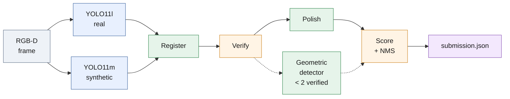
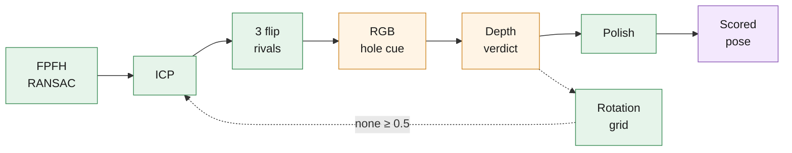
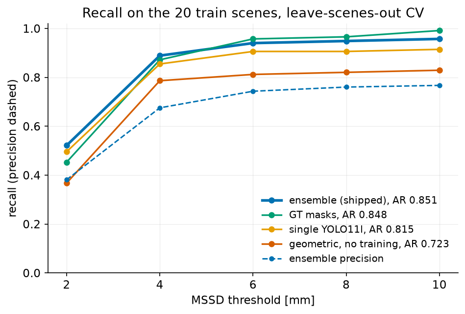
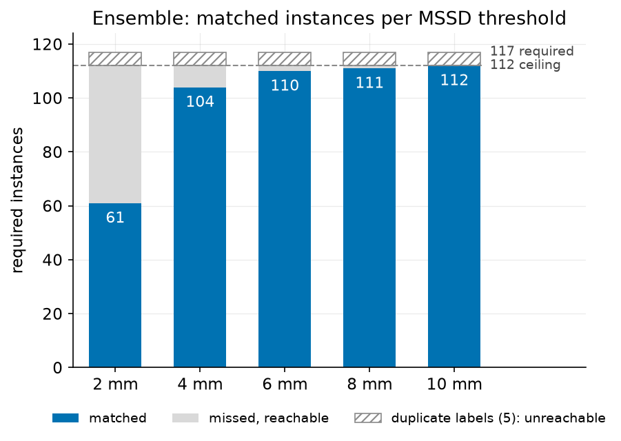
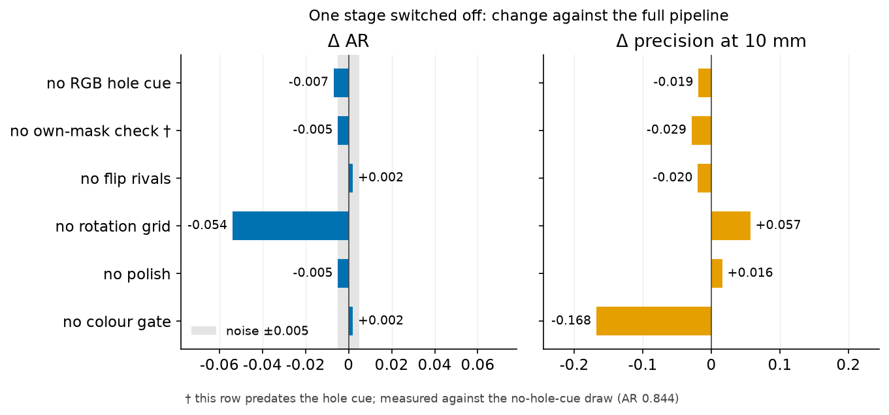
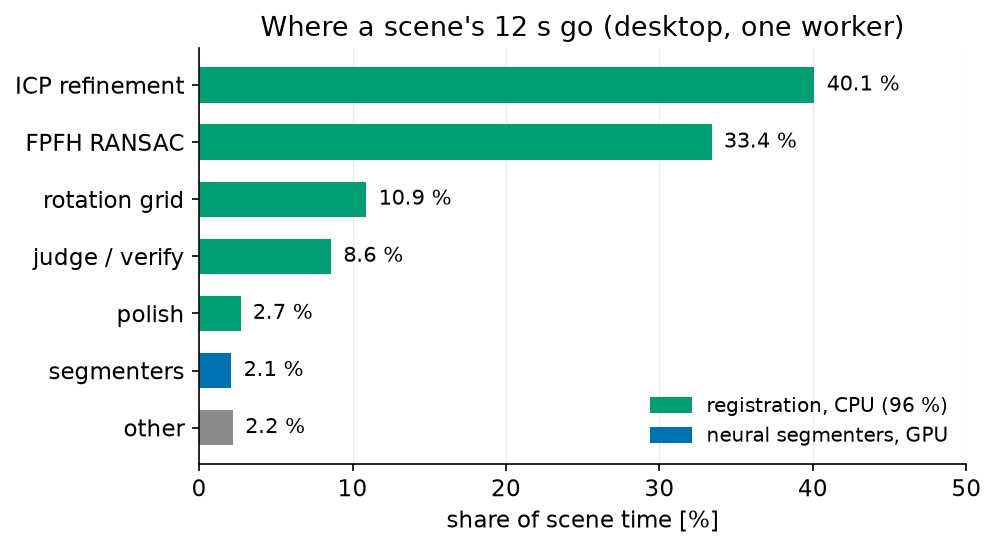
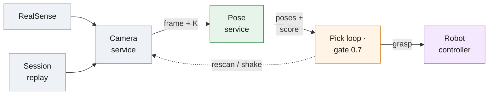
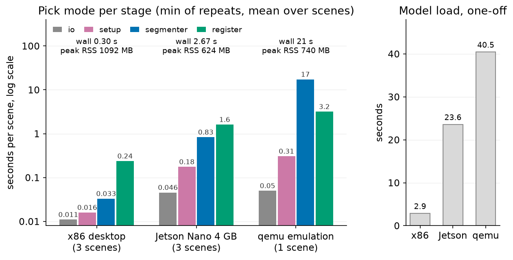
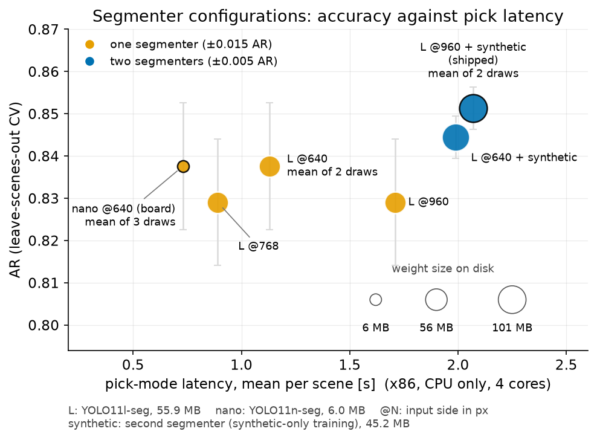

# 6-DoF Pose Estimation — Solution Report

## At a glance

- **Task.** Detect every instance of a rigid T-shaped part in an RGB-D tray
  scene and return its 6-DoF pose ([ASSIGNMENT.md](ASSIGNMENT.md)).
- **Method.** Two small instance segmenters propose masks; classical RGB-D
  geometry (FPFH-RANSAC → ICP → flip rivals → RGB hole cue → depth-map
  verification → hole-centre polish) estimates and *verifies* every pose;
  `score` = segmenter confidence × verification.
- **Accuracy.** Leave-scenes-out CV on the 20 train scenes, released
  `score.py`: **AR 0.851, top-1 1.000**, precision 0.767 at 10 mm
  (`results/train_ensemble_run1.json`); GT-mask baseline AR 0.848.
- **Ceiling reached.** 112 of 117 required instances matched at 10 mm; the
  5 misses are duplicate ground-truth labels no one-pose-per-part submission
  can claim ([analysis/failure_analysis.md](analysis/failure_analysis.md)).
- **Runtime.** 40 test scenes in 135 s at 6 workers on one desktop GPU
  (+15 s overlays), 160 s CPU-only; pick mode 0.7 s mean per scene
  ([analysis/runtime.md](analysis/runtime.md)).
- **Deployment.** Measured on a Jetson Nano 4 GB, CPU only: 2.6–2.7 s per
  pick, 624 MB peak RSS, poses agree with x86 to 0.04 mm
  ([deploy/board/README.md](deploy/board/README.md)).


*Predicted poses on eight test scenes, drawn by the released `visualize.py`; all 40 are in [overlays_test/](overlays_test/).*

**Provenance.** `submission.json` (363 poses over the 40 test scenes) was
produced at commit `d2ef188` by `scripts/run_pipeline.py --split test
--seg-model weights/part-seg.pt --extra-seg-model
weights/part-seg-synthetic.pt`; `overlays_test/` by the released
`visualize.py` on those poses. `./run_all.sh <release>` does exactly that.

## The problem, the metric

| | |
| --- | --- |
| Input | RGB image, depth map (integer millimetres), per-scene intrinsics `K`, the CAD model |
| Output | per instance: rotation `R`, translation `t`, a `score` that sets the ranking |
| Error | MSSD — the largest displacement of any model vertex between estimated and true pose |
| Recall, precision | at MSSD thresholds 2, 4, 6, 8, 10 mm; AR = mean recall over the five |
| Matching | predictions in descending `score`; each claims the closest unclaimed instance within the threshold |
| top-1 | fraction of scenes whose highest-scoring pose lies within 5 mm of an instance |
| Counted | instances ≥ 80 % visible; predictions on `ignore` regions are dropped, not counted as false positives |

The 20 train scenes carry ground truth, the 40 test scenes do not. Every
accuracy figure below is leave-scenes-out cross-validation on train, scored
with the released `score.py`.

## Method

The division of labour follows the measured bottleneck. With ground-truth masks the
registration stack alone reaches AR 0.848 (table below), so nearly all of
the gap between the training-free detector (0.723) and that ceiling lived
in instance segmentation — the component a network learns best from few
images. Pose *quality* is a geometry problem the depth
channel answers better than any regressor trained on 20 scenes. (BOP 2024
reached the same conclusion for the field: 2D detection, not pose
refinement, dominates the error budget.)



*Both segmenters feed the same chain: every proposal is registered, verified and polished; the training-free geometric detector joins only when fewer than two proposals verify.*

### Proposals (`src/detect_seg.py`)

- Two ultralytics segmenters share one proposal pool at a low confidence
  floor (0.25). Extra proposals cost only registration time: wrong ones die
  in verification.
- `weights/part-seg.pt`: YOLO11l-seg, all 20 train scenes incl. ignore
  masks, rotation/flip augmentation; 4-fold leave-scenes-out mask mAP50
  0.79–0.93.
- `weights/part-seg-synthetic.pt`: YOLO11m-seg trained on 1140
  domain-randomised BlenderProc renders of the CAD, no real image seen.
- Part-colour gate: a proposal must be ≥ 30 % part-coloured (the HSV gate
  the polish already uses). Without it the synthetic model, trained with
  randomised part colours, fires on plain light background, and a flat CAD
  plate sunk flush into the tray floor passes the depth check.
- Own-mask check: a verified pose must *explain the mask that proposed it*
  (≥ 150 of its points, or 30 %, within 3 mm of the posed model). The
  geometric detector already holds itself to this rule — a pose must explain
  the points that proposed it — and applying it to learned masks removes
  registrations that drifted off their proposal and verified somewhere else.
- Back-projection (`src/scene_io.py`): masked depth pixels lift to a
  camera-frame cloud (depth is registered to colour; per-scene intrinsics).

### Registration and verification (`src/register.py`, `src/verify.py`)



*One mask proposal: global init, refinement, symmetric rivals, two verdicts, polish; the rotation grid re-seeds ICP only when no candidate verifies at 0.5.*

- **Global init.** FPFH + RANSAC (Open3D), scene → model.
- **Refinement.** Coarse-to-fine point-to-plane ICP; robust Tukey kernel
  only in the fine stages (a kernel narrower than the remaining
  misalignment freezes ICP).
- **Flip rivals.** The part is nearly 180°-symmetric about its own axes, so
  every converged pose spawns three flipped rivals (π about X/Y/Z through
  the centroid), each re-refined.
- **RGB hole cue.** The depth verdict only judges pixels where the posed
  model has surface, so a predicted through-hole is its blind spot — and
  that is exactly where a half-turn about the stem hides. Solid
  part-coloured surface at or in front of a predicted hole's own rim plane
  is material the pose claims is empty; that objection re-ranks the rivals
  before the shortlist. The sign matters: punishing colour merely *near*
  the rim depth is worse than nothing, because a real hole frames whatever
  lies a few millimetres below it.
- **Depth-map verification.** Render-free z-buffer test of the posed model
  against the observed depth. Model pixels sitting *in front of* the
  measured surface are physically impossible ("free-space violation");
  confidence = support − 2·violation, with slope-aware margins on steep
  faces. Verification, not ICP fitness, picks between rivals: a flip
  explains the visible surface but pokes through free space.
- **Rotation-grid fallback.** When nothing verifies (≥ 0.5), a
  Fibonacci-sphere rotation grid (192 orientations when the proposal
  anchors the translation, as every mask does; 60 otherwise) is
  coarse-ICP'd, ranked by the depth verdict, and the best few fully
  refined. On the geometric path this fixed 14 of the 15 hard instances
  feature matching missed.
- **Polish** (`src/edge_refine.py`). 1 mm depth quantisation erases ~2 mm
  of in-plane information (see Limitations). A final stage alternates a
  deadzoned Gauss-Newton against the CAD mesh (holds z + tilt) with
  hole-centre alignment: the through-holes are instance-private, sub-pixel
  image features, and matching predicted vs observed hole centroids pins
  the in-plane shift (and roll, given ≥ 3 holes).

### Scoring and NMS

- The submission `score` is the joint belief: segmenter confidence ×
  verification. Ranking drives the scorer's matching order and top-1, so
  weak proposals may add recall but never outrank solid poses.
- Duplicates are suppressed only when position (< 9 mm) *and* orientation
  (< 30°) coincide — stacked parts sit one thickness apart but never share
  orientation.

### Domain-shift safety net (`src/detect.py`)

- When fewer than two detections verify at ≥ 0.5, the training-free
  geometric detector sweeps the scene too and the union is de-duplicated
  (`detect_scene_hybrid`).
- Its chain: colour gate → smooth-surface patches at depth/normal breaks →
  register top-of-pile first and carve out explained points → hole-pair
  proposals for coplanar flats.
- Alone it scores AR 0.723: the no-GPU, no-training baseline.

## Results (train split, released `score.py`)

| Setting                                        | 2 mm  | 4 mm  | 6 mm  | 8 mm  | 10 mm | AR    | top-1 |
| ---------------------------------------------- | ----- | ----- | ----- | ----- | ----- | ----- | ----- |
| GT masks → registration (one proposal/instance) | 0.453 | 0.872 | 0.957 | 0.966 | 0.991 | 0.848 | 1.000 |
| Geometric detector, no training †              | 0.368 | 0.786 | 0.812 | 0.821 | 0.829 | 0.723 | 0.950 |
| Single segmenter (YOLO11l, conf 0.4) †         | 0.496 | 0.855 | 0.906 | 0.906 | 0.915 | 0.815 | 1.000 |
| **Two-segmenter ensemble (submitted)**         | 0.521 | 0.889 | 0.940 | 0.949 | 0.957 | **0.851** | **1.000** |
| ↳ precision of the submitted config            | 0.381 | 0.675 | 0.743 | 0.760 | 0.767 |       |       |

Recall (last row: precision) at each MSSD threshold. Learned-mask rows
stitch four leave-scenes-out folds, so every scene is predicted by a model
that never saw it. Every row is a file in [results/](results/)
(`train_gt_masks.json`, `train_geometric.json`, `train_yolo11l_single.json`,
`train_ensemble_run1.json`) that `score.py` re-scores in seconds.
† measured before the own-mask check and the RGB hole cue were added
(commit `369dc7e`); both stages only remove false positives or settle stem
flips, so these two rows are conservative baselines. A single-segmenter
draw on the current code at conf 0.25 scores AR 0.829
(`results/nano_single_960.json`, ±0.015 band).



*Recall against the MSSD threshold for the four table rows; the dashed line is the submitted configuration's precision.*

**Run-to-run variance.** Open3D's RANSAC is stochastic (its OpenMP threads
share one random engine, so a seed does not make it bit-reproducible). Both
draws of the submitted configuration give AR 0.851 with the same
per-instance result (`train_ensemble_run1.json`, `train_ensemble_run2.json`);
draws without the hole cue span 0.836–0.844 (`ablation_no_hole_cue*.json`,
`ablation_no_own_mask*.json`). Deltas under ±0.005 AR are noise for
two-segmenter rows; single-segmenter rows swing about ±0.015
([analysis/edge_model.md](analysis/edge_model.md)).

**Why the ensemble edges past the GT-mask row.** Two segmenters × ~2
proposals per instance means several independent RANSAC/ICP registrations
per instance where the GT-mask run gets one proposal; predicted masks also
avoid the GT masks' occlusion-boundary pixels, and the two models miss
different instances. The GT-mask row is nevertheless the more accurate one
at 10 mm (0.991): registering each labelled mask separately, it claims both
copies of a duplicate annotation, which a de-duplicated submission cannot.
The price of the ensemble is precision (0.767 at 10 mm): unmatched
low-score proposals cost precision but never AR or top-1.

**Score gate.** A deployment trades recall for precision by thresholding
`score`: ≥ 0.4 gives precision 0.859 at AR 0.841; ≥ 0.6 gives 0.962 at
0.786; ≥ 0.7 gives 0.989 at 0.716; top-1 stays 1.000 up to gate 0.8
([analysis/score_calibration.md](analysis/score_calibration.md)).


*Reliability of `score` against correct-at-5-mm (left) and the recall/precision operating point of each gate (right).*

## Analysis

Six studies live in [analysis/](analysis/), each stating the command and
the `results/` files behind it. The four below cover the submitted
configuration; the two edge studies appear in the deployment section.

### Failure analysis

Of 117 required instances, this draw matches 112 at 10 mm; the 5 misses are
duplicate labels — a second `poses.json` entry 0.6–3.6 mm from another on
the same part (masks IoU 0.91–0.95) in 000022, 000030, 000041 — so any
one-pose-per-part submission caps at 112/117 = 0.957, and the pipeline's own
error at 10 mm is zero: no segmenter miss (the fold segmenter puts a mask of
IoU ≥ 0.79 on every missed instance), no mislocalisation. Predicting every
pose twice at half score would recover 4 of the 5 duplicates (~+0.02 AR) —
deliberately not done: it games a label defect and halves precision.

Before the RGB hole cue, two stem-axis flips (half-turns about the stem,
6–9 mm off) were also missed: 000047 #3, where the sensor flattens the 11 mm
boss so the depth verdict genuinely prefers the flip (0.72 vs 0.19), and
000041 #0, where the verdict prefers the truth (0.744 vs 0.682) but RANSAC
never landed in that basin. The RGB hole cue settles both (73 → 6 mm on
000047 #3).

Hole claim confirmed on the matched instances: MSSD median 1.76 mm with both
large holes visible (99 % < 4 mm, n 81) vs 2.82 mm with none (77 % < 4 mm,
n 22); tilt matters only through the holes.

All 34 false positives are wrong registrations of real parts (8 half-turn
flips, 26 other), none on background; their median `score` is 0.41 vs 0.86
for true positives, which is why the gate buys precision cheaply.
Per-instance tables and crops:
[analysis/failure_analysis.md](analysis/failure_analysis.md),
`scripts/analyze_failures.py`.



*Of 117 required instances, how many match at each threshold; the five duplicate labels cap 10 mm recall at 112.*

### Score calibration

`score` ranks reliably (AUROC 0.94 for "within 5 mm"; the top pick of every
scene scores ≥ 0.85 and lands within 3.2 mm) but is not a calibrated
probability (ECE 0.143 at 5 mm: over-confident in the middle bins,
under-confident above 0.7 — a monotone recalibration would fix the level
without changing the ranking). Recommended cell gate: `score` ≥ 0.7 →
precision 0.99 at 5 mm and 0.989 at 10 mm on the CV predictions (0.94 /
0.962 at ≥ 0.6), top-1 1.000. Figure above;
[analysis/score_calibration.md](analysis/score_calibration.md),
`scripts/score_calibration.py`.

### Ablation

One stage off per CV run, measured against the shipped configuration
([analysis/ablation.md](analysis/ablation.md), `scripts/eval_seg_folds.py
--ablate`). Noise band ±0.005 AR.

- Rotation-grid fallback: −0.054 AR (0.797; 10 mm recall 0.880), the
  largest single effect.
- Part-colour gate: precision 0.599 → 0.767 at equal AR (224 → 185
  predictions).
- RGB hole cue: +0.007 AR (0.844 → 0.851) and the last two stem-axis flips,
  precision 0.748 → 0.767.
- Own-mask check (measured against the no-cue baseline 0.844): +0.005 AR,
  inside the noise band, and +0.03 precision (0.719 → 0.748) — it removes 6
  false positives and can never add a pose.
- Polish: +3 instances at 2 mm (0.496 → 0.521), nothing above.
- Flip rivals: ±0 on this path (0.853 without vs 0.851 with = noise) — the
  grid subsumes them; kept as insurance on the geometric path, at three
  extra ICP chains per RANSAC start.



*Change in AR and in precision at 10 mm when one stage is switched off; the shaded band is the run-to-run noise.*

### Runtime

Registration is 96 % of scene time (ICP 40 %, FPFH-RANSAC 33 %, rotation
grid 11 %, judge/verify 9 %, polish 3 %) and the two segmenters 2 %, so on
the full sweep a GPU buys 19 % throughput and no latency. Full sweep 12 s
per scene single-worker, 135 s for the split at 6 workers (160 s CPU-only),
up to 48 s on the densest pile. **Pick mode** (`--pick`: stop at the first
pose scoring ≥ 0.8) 0.7 s mean / 2.1 s max per scene on GPU; CPU-only on
4 cores 1.6–2.4 s, because with registration cut short the two segmenters
become the larger share. It returned a committed pose in 40/40 test scenes. Peak RSS
1.87 GB per worker with GPU, 1.58 GB CPU-only, ~0.9 GB GPU memory
([analysis/runtime.md](analysis/runtime.md)).



*Share of desktop scene time per stage: the registration chain is 96 %, the segmenters 2 %.*

## Design notes and dead ends

- **Scoring the metric, not the pixels.** MSSD is evaluated at model
  vertices up to ~39 mm from the origin, so 1° of rotation error costs
  ~0.7 mm; the 2 mm threshold demands ~1 mm / 1° accuracy. Matches to
  instances below 80 % visibility are free, so the pipeline predicts
  generously and lets `score` rank.
- **Depth quantisation is the accuracy floor.** The depth PNGs are integer
  millimetres. ICP initialised *at the ground truth* drifts ~2.4 mm away:
  whole neighbourhoods of poses explain the quantised staircase equally
  well. Deadzoned objectives, mesh-exact Gauss-Newton, denser model
  sampling and bilateral smoothing all leave a ~2 mm in-plane floor, which
  is why 2 mm recall plateaus near 0.5 while 4 mm recall reaches ~0.9.
- **Silhouette chamfer fails in piles.** Every neighbour shares the part's
  colour, so rim points snap to the neighbour's edge, several pixels off.
  Hole centroids do not have this failure mode.
- **Verification beats fitness.** ICP fitness cannot tell a correct pose
  from a near-symmetric flip (both explain the visible surface); free-space
  violation can. One train instance (000047 #3) defeats the depth verdict
  alone: its flipped pose fits the observed depth better than the ground
  truth (confidence 0.72 vs 0.19) because the sensor flattens the
  distinguishing boss; the RGB hole cue settles it
  ([analysis/failure_analysis.md](analysis/failure_analysis.md)).
- **Background proposals.** Before the part-colour gate, the synthetic-only
  segmenter produced ~70 confident masks on plain background across the
  test split, and a flat CAD plate sunk ~7 mm into the tray floor passes
  free-space verification (nothing is *in front of* the surface). The gate
  removes them with no change in AR/top-1 (CV precision at 10 mm
  0.56 → 0.73 before the own-mask check, 0.599 → 0.767 with it). A
  colour-agnostic alternative would gate on height above the support
  plane; not shipped.

## Limitations

- Instances lying so that no through-hole is visible keep depth-only
  in-plane accuracy (~2 mm); their 2 mm recall is low.
- **Domain shift.** The primary segmenter was fine-tuned on 20 real scenes;
  it generalises across scenes of this capture setup (leave-scenes-out) but
  a genuinely new environment costs accuracy. The system is layered against
  that, and every layer is measured on the train split:

  | Tier | Needs | AR |
  | ---- | ----- | -- |
  | Real-trained segmenter alone (YOLO11l) | this environment | 0.815 (0.851 in the submitted ensemble) |
  | **Synthetic-only segmenter** (`scripts/render_synthetic.py`) | nothing real: trained purely on domain-randomised CAD renders | 0.814 (top-1 1.000) zero-shot on the real scenes |
  | Geometric detector, colour gate | the part's colour | 0.723 |
  | Geometric detector, depth foreground (`foreground="depth"`, Python API) | nothing but depth | recovers most instances, colour-blind |

  The depth-map verifier is environment-agnostic throughout — bad masks
  produce *low-confidence* poses, never confident mistakes. The two
  segmenters always share one proposal pool; the colour-gate geometric
  detector joins automatically when fewer than two detections verify at
  ≥ 0.5 (`detect_scene_hybrid`); the depth-foreground detector is a manual
  switch. A **new part** needs no code: `scripts/onboard_new_part.py`
  renders and trains a segmenter from its CAD with zero hand labels, and the
  pose stack reads any CAD at load time. A **new part colour** needs the
  HSV constants in `src/detect.py` retuned (proposal gate, hole polish,
  geometric fallback).
- Registration assumes the depth map is metrically consistent with the
  colour image and intrinsics (true for this dataset).
- **Runtime.** Desktop figures are in Analysis. The geometric fallback is
  CPU-only research code: 10–90 s per scene, up to ~10 min on the densest
  piles.

## From the assignment to a cell

The assignment metric is stricter than the production task. A robot picks
*one* part per cycle, then rescans, so the loop is governed by top-1
(1.000 here) rather than full-scene AR, and every pick thins the pile.
`--pick` implements that loop: stop at the first pose scoring ≥ 0.8
(0.7 s per scene on the desktop GPU); the cell gates on `score` ≥ 0.7 and
rescans or shakes otherwise. `deploy/pose/adapter.py` is the seam where a
camera SDK plugs in — one registered RGB-D frame + intrinsics becomes the
same `Scene` the offline runner uses (verified identical output on a test
scene).



*Three processes on one device; a recorded session replays through the same camera interface as a real sensor.*

`deploy/` holds exactly this, one folder per concern
([deploy/README.md](deploy/README.md), [deploy/ARCHITECTURE.md](deploy/ARCHITECTURE.md)):

- **Camera service** (`deploy/camera/`): `/v1/frame`,
  `/v1/intrinsics`, `/preview.mjpg`, `/healthz`, `/metrics`; sources scene
  folder, session replay or RealSense.
- **Pose service** (`deploy/pose/`): `/v1/estimate`, `/healthz`,
  `/readyz`, `/metrics`; the same `detect_scene_hybrid` and `PoseEstimator`
  that produced the submission; `score` = seg conf × depth verification,
  gate 0.7; every pose carries the configuration digest that produced it.
- **Pick layer** (`deploy/pick/`): grasp planning from `grasps.part.json`,
  hand-eye calibration, a drift monitor, the pick policy pick → rescan →
  shake → stop, and `runner.py`, the loop that drives the three services.
- **Demo loop** (`deploy/demo/cell_demo.py`): the three collapsed
  into one process for a board demonstration, writing an annotated video as
  it goes. It has not been run on the board yet (the board was offline); no
  board demo video exists.

### What the board does

| Configuration | Hardware | Pick latency | Peak RSS | AR (CV) | Source |
| --- | --- | --- | --- | --- | --- |
| Two segmenters @960 (shipped) | desktop, RTX 4070 Ti SUPER | 0.7 s mean / 2.1 s max | 1.87 GB | 0.851 | `analysis/runtime.md` |
| Two segmenters @960 (shipped) | desktop, CPU only, 4 cores | 1.6–2.4 s | 1.58 GB | 0.851 | `analysis/runtime.md` |
| One YOLO11n @640 (board profile) | desktop, CPU only, 4 threads | 0.29–0.31 s | 1.09 GB | 0.837 | `results/bench/native_nano640.json` |
| One YOLO11n @640 (board profile) | Jetson Nano 4 GB, CPU only | 2.6–2.7 s | 0.62 GB | 0.837 | `results/bench/board_nano640.json` |

AR is the configuration's leave-scenes-out CV, measured on x86; the board was
not scored on the train split, and single-segmenter rows carry a ±0.015 band.

Measured on the real board (JetPack 4.6 / L4T R32.7.6, Docker 20.10, MAXN,
CPU only; 3 scenes × 3 repeats): a pick takes 2.6–2.7 s after warm-up
(segmenter 0.84 s, registration ≈ 1.6 s, I/O 0.05 s, setup 0.18 s), peaks
at 624 MB, and the one-off model load is 23.6 s. The poses agree with the
x86 run to 0.04 mm / 0.14°. The full 40-scene test split also ran on the
board in full-sweep mode
([results/board/test_sweep_nano640.json](results/board/test_sweep_nano640.json)):
329 poses in 34 min, 51.5 s mean / 237 s worst per scene; 95.1 % of the
poses lie within 2 mm / 2° of the x86 run against 96.7 % for two x86 runs
of the same configuration, with the same worst-case scene (000043) — the
board is, on this sweep, not distinguishable from another RANSAC draw. Before the board was
reachable, qemu emulation predicted 20.9 s per pick and 740 MB
(`results/bench/emulated_nano640.json`): 7.7× pessimistic on time, 19 %
over on memory.



*Per-stage seconds for one pick on x86, on the Jetson Nano and under qemu, peak RSS annotated.*

The board profile is one segmenter, `weights/part-seg-nano.pt` (YOLO11n-seg
at 640 px, 6.0 MB), in pick mode
([deploy/board/config.nano.json](deploy/board/config.nano.json)).
Trained with the shipped recipe on the same folds, it reaches AR 0.837
(mean of three draws) against 0.838 for the large model downscaled to 640
and 0.851 shipped: what the board gives up is the second segmenter
(~0.014 AR), not the backbone. Per frame on the CPU it costs 49 ms against
619 ms for the shipped segmenter at 960; top-1 stays 1.000 in every
configuration and draw
([analysis/edge_model.md](analysis/edge_model.md),
[analysis/nano_profile.md](analysis/nano_profile.md)).



*Segmenter configurations: AR against pick latency on four CPU cores; marker size is the weight file size.*

**Packaging.** `./setup.sh` builds the venv from the exact pins
(`requirements-lock.txt`, CPU or CUDA); `Dockerfile` is a CPU
image (1.24 GB compressed) that reproduced the submission poses with `--network none`
— inference makes no network request; a wheelhouse recipe covers air-gapped
x86 ([docs/offline-install.md](docs/offline-install.md)). `deploy/board/` holds
the Python 3.8 / aarch64 pin set, Dockerfile, systemd unit, preflight,
benchmark and acceptance scripts; the Docker image is the validated path
onto the board ([deploy/board/README.md](deploy/board/README.md)).
Not verified on the board: the CUDA torch path, memory headroom with a
desktop session running, the systemd unit under cgroup v1, a real camera on
the live path.

**Sensor.** Below 4 mm the measured bottleneck is the sensor, not the
algorithm — an industrial structured-light camera (30–100 µm noise) would
let this same registration stack settle near its ~0.3–0.5 mm verification
floor without algorithmic changes. Next upgrades: in-hand verification for
assembly-grade accuracy, a wrist-mounted second viewpoint for steeply
leaning parts, and site-collected scenes (self-labelled by the gripper's
success sensor) as a permanent regression set.

## Repository layout

```text
ASSIGNMENT.md        the task as received
README.md            entry point: what is here and how to run it
report.md            this file
submission.json      test-split poses (363 over 40 scenes) · overlays_test/  the 40 overlays
setup.sh             venv from the pinned lock (--cpu | --cuda | --jetson-nano)
run_all.sh           one-command run on any release folder (auto-scores if GT present)
score.py, visualize.py   released with the assignment, unchanged
src/                 scene_io (loading, back-projection) · model_cloud (CAD sampling,
                     FPFH, hole discovery) · register (RANSAC, ICP, flips, grid,
                     hole-pair proposals) · verify (depth-map verification, RGB hole
                     cue) · edge_refine (polish) · detect (geometric detector, colour
                     gate, NMS) · detect_seg (learned masks + hybrid fallback) ·
                     surface_patches
scripts/             run_pipeline (full pipeline over a split, --pick) ·
                     eval_oracle_masks · eval_seg_folds (leave-scenes-out CV,
                     --ablate) · analyze_failures · score_calibration ·
                     make_seg_dataset · render_synthetic (BlenderProc) ·
                     onboard_new_part · merge_submissions · make_figures
weights/             part-seg.pt (YOLO11l-seg, all 20 train scenes) ·
                     part-seg-synthetic.pt (YOLO11m-seg, 1140 synthetic renders) ·
                     part-seg-nano.pt (YOLO11n-seg @640, 6.0 MB, board profile) ·
                     part-seg-nano.onnx
results/             prediction JSONs behind every table and ablation row ·
                     bench/ (x86, qemu, board pick benchmarks) · board/ (40-scene
                     board sweep)
analysis/            failure_analysis · score_calibration (+ .png) · ablation ·
                     runtime · nano_profile · edge_model · failures/ (crops)
docs/figures/        the plots in this report, made by scripts/make_figures.py
docs/offline-install.md   wheelhouse and Docker recipes for an air-gapped x86 machine
Dockerfile, requirements-lock.txt   CPU image and exact pins that reproduce the submission
deploy/              the vision cell for the Jetson Nano, one folder per concern:
                     camera/ (frames as a service, session record + replay) ·
                     pose/ (the estimator as a service, adapter.py for one frame) ·
                     pick/ (grasp, hand-eye, drift, policy, the pick loop) ·
                     demo/ (HUD, video, cell_demo.py: the one-process board demo) ·
                     board/ (Jetson Nano: pins, Dockerfile, systemd unit, provision,
                     preflight, bench, acceptance)
```

`src/`, `scripts/`, `results/`, `analysis/`, `weights/` and `deploy/` each
carry a `README.md` that describes their files.

## Reproducing

```bash
./setup.sh                                  # .venv from requirements-lock.txt (Python 3.12; --cpu/--cuda)
./run_all.sh <release_path> [split]         # submission + overlays (+ score if GT)
./run_all.sh <release_path> test            # a private release: same command, its test split
# or: docker build -t pose-est:cpu . && docker run --rm --network none \
#         -v <release_path>:/data:ro -v $PWD/out:/out pose-est:cpu /data test /out

# Figures in this report (docs/figures/*.png) from results/ and analysis/:
.venv/bin/python scripts/make_figures.py

# Table rows (train split):
.venv/bin/python scripts/eval_oracle_masks.py --root . --workers 6 --out results/train_gt_masks.json
.venv/bin/python scripts/run_pipeline.py --root . --split train --out results/train_geometric.json --workers 6
.venv/bin/python score.py --release . --split train --submission results/train_gt_masks.json

# Leave-scenes-out CV of the learned-mask rows (retrains 4 fold models; GPU).
# Give project= an ABSOLUTE path: ultralytics puts relative ones under its
# global runs_dir. Hyper-parameters exactly as the shipped weights were trained.
.venv/bin/python scripts/make_seg_dataset.py --root . --out seg_data/fold0 --val-scenes 000007 000014 000021 000033 000047
# ... folds 1-3 as in scripts/eval_seg_folds.py, then per fold:
.venv/bin/yolo segment train model=yolo11l-seg.pt data=seg_data/fold0/data.yaml \
    project=$PWD/seg_runs_l name=fold0 imgsz=960 epochs=250 patience=60 batch=3 \
    amp=False optimizer=AdamW lr0=0.0002 cos_lr=True degrees=180 flipud=0.5 fliplr=0.5
.venv/bin/python scripts/eval_seg_folds.py --root . --runs seg_runs_l --conf 0.4 --out results/train_yolo11l_single.json
.venv/bin/python scripts/eval_seg_folds.py --root . --runs seg_runs_l \
    --extra-weights weights/part-seg-synthetic.pt --conf 0.25 --out results/train_ensemble_run1.json
# ablation rows: add --ablate no_grid | no_flips | no_polish | no_gate | no_own_mask
# analyses:
.venv/bin/python scripts/analyze_failures.py --root . --submission results/train_ensemble_run1.json --out analysis
.venv/bin/python scripts/score_calibration.py --root . --submission results/train_ensemble_run1.json --out analysis

# Shipped weights: same recipe on the full split -> weights/part-seg.pt.
.venv/bin/python scripts/make_seg_dataset.py --root . --out seg_data/full
# Synthetic-only model: onboard_new_part.py renders (BlenderProc), carves a
# 5% val split, writes data.yaml and trains in one go; the shipped weight
# used epochs=80 patience=25 batch=4 (yolo11m-seg, no rotation augmentation).
.venv/bin/python scripts/onboard_new_part.py --cad model/3d_model.ply --workdir onboard_part --frames 1200 --epochs 80
```

`amp=False` with AdamW at `lr0=2e-4` is required — the default recipe
diverges on this 20-image dataset. `blenderproc` is needed only for the
synthetic-data scripts (not in `requirements.txt`). The board profile's
recipe and benchmark commands are in
[analysis/edge_model.md](analysis/edge_model.md) and
[deploy/board/README.md](deploy/board/README.md).

## Tools disclosure

Developed with the assistance of Claude Code (Anthropic), used as a coding
assistant for implementation, debugging and experiment automation under my
direction. Libraries: Open3D (registration primitives), OpenCV, NumPy,
SciPy, trimesh, matplotlib, Ultralytics YOLO11 (instance segmentation) and
BlenderProc (synthetic rendering). No external images or labels: the
segmenters are fine-tuned from the public COCO-pretrained YOLO11 checkpoints
on the released train split and on synthetic scenes rendered from the
released CAD only.
