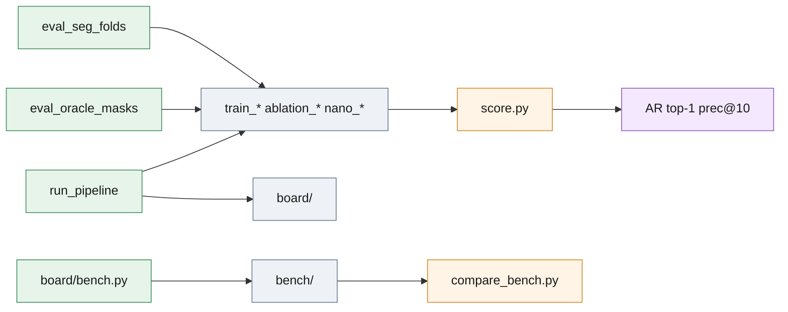

# `results/` — the file behind every number

Every accuracy figure in [report.md](../report.md) and [analysis/](../analysis/README.md)
is a train-split prediction JSON here, in the submission format, that the
released `score.py` re-scores in about two seconds:

```bash
.venv/bin/python score.py --release <release> --split train --submission results/<file>.json
```

`<release>` is the dataset folder holding `train/` and `model/` (`.` when it
is unpacked in the repository root, as `run_all.sh` expects). AR, top-1 and
precision at 10 mm below are `score.py`'s output on the committed files,
re-run on 2026-08-18. Learned-mask rows are leave-scenes-out CV over the
20 train scenes (117 required instances): every scene is predicted by a
fold model that never saw it. Noise band from repeated draws (RANSAC is
stochastic): about ±0.005 AR for two-segmenter rows, ±0.015 for
single-segmenter rows ([analysis/nano_profile.md](../analysis/nano_profile.md)).



*Accuracy files are scored by `score.py`; the timing records under `bench/`
and `board/` are compared across machines, not scored.*

## Main table rows

Plot [docs/figures/recall_vs_threshold.png](../docs/figures/recall_vs_threshold.png);
commands in [scripts/README.md](../scripts/README.md) and [report.md, Reproducing](../report.md#reproducing).

| File | Configuration | Produced by | AR | top-1 | prec@10 | preds |
| --- | --- | --- | --- | --- | --- | --- |
| `train_ensemble_run1.json` | **Two-segmenter ensemble, the submitted configuration** | `eval_seg_folds.py --runs seg_runs_l --conf 0.25 --extra-weights weights/part-seg-synthetic.pt` | **0.851** | **1.000** | 0.767 | 185 |
| `train_ensemble_run2.json` | second draw of the same | same command | 0.851 | 1.000 | 0.778 | 180 |
| `train_gt_masks.json` | ground-truth masks → registration, one proposal per instance | `eval_oracle_masks.py` | 0.848 | 1.000 | 0.983 | 135 |
| `train_yolo11l_single.json` | single segmenter (YOLO11l folds), conf 0.4 | `eval_seg_folds.py --runs seg_runs_l --conf 0.4` † | 0.815 | 1.000 | 0.863 | 152 |
| `train_synthetic_only.json` | synthetic-only segmenter, zero-shot on real scenes | `eval_seg_folds.py --weights weights/part-seg-synthetic.pt` † | 0.814 | 1.000 | 0.779 | 168 |
| `train_geometric.json` | geometric detector, no training, no GPU | `run_pipeline.py --split train` without `--seg-model` † | 0.723 | 0.950 | 0.511 | 224 |

† measured before the own-mask check and the RGB hole cue were added
(commit `369dc7e`); these are the numbers `report.md` quotes.

## Ablation rows

One stage off per file via `eval_seg_folds.py --ablate <stage>`, otherwise the
submitted command; baseline `train_ensemble_run1.json` (AR 0.851, prec@10 0.767).
Reading in [analysis/ablation.md](../analysis/ablation.md), plot [docs/figures/ablation_bars.png](../docs/figures/ablation_bars.png).

| File | Stage off | AR | top-1 | prec@10 | preds |
| --- | --- | --- | --- | --- | --- |
| `ablation_no_hole_cue.json` | RGB hole cue | 0.844 | 1.000 | 0.748 | 185 |
| `ablation_no_hole_cue_run2.json` | RGB hole cue, second draw | 0.839 | 1.000 | 0.743 | 186 |
| `ablation_no_own_mask.json` | own-mask check; predates the cue, so the cue is off too — compare with `ablation_no_hole_cue.json` | 0.839 | 1.000 | 0.719 | 191 |
| `ablation_no_own_mask_run2.json`, `ablation_no_own_mask_run3.json` | same two stages off, two more draws | 0.836, 0.836 | 1.000 | 0.732, 0.741 | 185, 184 |
| `ablation_no_flips_v2.json` | flip rivals | 0.853 | 1.000 | 0.747 | 186 |
| `ablation_no_grid_v2.json` | rotation-grid fallback | 0.797 | 1.000 | 0.824 | 157 |
| `ablation_no_polish_v2.json` | polish (2 mm recall 0.496 vs 0.521) | 0.846 | 1.000 | 0.783 | 181 |
| `ablation_no_gate_v2.json` | part-colour gate | 0.853 | 1.000 | 0.599 | 224 |
| `ablation_no_flips.json`, `ablation_no_grid.json`, `ablation_no_polish.json`, `ablation_no_gate.json` | the same four stages, measured before the hole cue existed (two stages off each); superseded by the `_v2` files, kept as extra draws | 0.844, 0.795, 0.839, 0.846 | 1.000 | 0.738, 0.792, 0.760, 0.569 | 188, 164, 183, 233 |

## Jetson segmenter profile rows

Same CV at conf 0.25 with fewer segmenters, a smaller input side or a smaller
backbone (`seg_runs_n` = YOLO11n-seg fold models trained at 640). Reading in
[analysis/nano_profile.md](../analysis/nano_profile.md) and [analysis/edge_model.md](../analysis/edge_model.md),
plot [docs/figures/edge_tradeoff.png](../docs/figures/edge_tradeoff.png). Single-segmenter rows: read each as one draw (±0.015).

| File | `eval_seg_folds.py` flags | AR | top-1 | prec@10 | preds |
| --- | --- | --- | --- | --- | --- |
| `nano_single_960.json` | `--runs seg_runs_l --imgsz 960` (one segmenter, YOLO11l) | 0.829 | 1.000 | 0.866 | 161 |
| `nano_single_768.json` | `--runs seg_runs_l --imgsz 768` | 0.829 | 1.000 | 0.866 | 156 |
| `nano_single_640.json` | `--runs seg_runs_l --imgsz 640` | 0.827 | 1.000 | 0.845 | 157 |
| `nano_single_640_run2.json` | same, second draw | 0.848 | 1.000 | 0.875 | 158 |
| `nano_dual_640.json` | `--runs seg_runs_l --imgsz 640 --extra-weights weights/part-seg-synthetic.pt` | 0.844 | 1.000 | 0.778 | 177 |
| `nano_yolo11n_640.json` | `--runs seg_runs_n --imgsz 640` — the board's model (`weights/part-seg-nano.pt` recipe) | 0.846 | 1.000 | 0.882 | 155 |
| `nano_yolo11n_640_run2.json`, `nano_yolo11n_640_run3.json` | same, two more draws (mean of the three 0.837) | 0.834, 0.832 | 1.000 | 0.880, 0.873 | 151, 151 |
| `nano_yolo11n_640_dual.json` | `--runs seg_runs_n --imgsz 640 --extra-weights weights/part-seg-synthetic.pt` | 0.839 | 1.000 | 0.752 | 182 |
| `nano_runtime.json` | not predictions: per-scene wall time and peak RSS of five segmenter configurations × (pick, full sweep), 5 test scenes, x86 pinned to 4 P-cores, CPU only | — | — | — | — |

## `bench/` and `board/` — timing records, not scored

`bench/*.json` come from [`deploy/board/bench.py`](../deploy/board/README.md)
with one command line (nano weight, `--imgsz 640`, `--pick`, 4 threads, CPU only);
`compare_bench.py` diffs them: same poses within 2 mm / 2° is the gate, wall time is
reported without a verdict. Plot [docs/figures/board_vs_desktop.png](../docs/figures/board_vs_desktop.png).

| File | Machine | What it holds |
| --- | --- | --- |
| `bench/native_nano640.json` | x86 desktop (i5-14600K), board profile | scenes 000001 000002 000015 × 3 repeats: 0.29–0.31 s per pick (best of 3; the first call after load 1.0 s); peak RSS 1092 MB; model load 2.9 s |
| `bench/emulated_nano640.json` | qemu-user aarch64 on that desktop, board CPU and memory limits, the board's own torch 2.4.1 / open3d 0.18 | scene 000001 × 1: 20.9 s per pick, peak RSS 740 MB, load 40.5 s — an upper bound, not a timing |
| `bench/board_nano640.json` | **Jetson Nano 4 GB, JetPack 4.6 / L4T R32.7.6, Docker 20.10, MAXN, CPU only — the real board** | same 3 scenes × 3: 2.6–2.7 s per pick (best of 3; the first call after load 5.1 s); stages io 0.045 / setup 0.18 / segmenter 0.84 / register 1.58–1.64 s; peak RSS 624 MB; load 23.6 s; poses agree with x86 to 0.04 mm / 0.14° |
| `board/test_sweep_nano640.json` | the same board, full-sweep mode over all 40 test scenes (submission format) | 329 poses in 34 min, 51.5 s mean / 237 s worst per scene; 95.1 % of poses within 2 mm / 2° of the x86 run, against 96.7 % between two x86 runs |
| `board/test_sweep_nano640.log.gz` | that sweep's log | per scene: poses found, seconds, scores |

The board files are the only measurements taken on the target hardware; every
other number in this folder comes from the x86 desktop of [analysis/runtime.md](../analysis/runtime.md).
