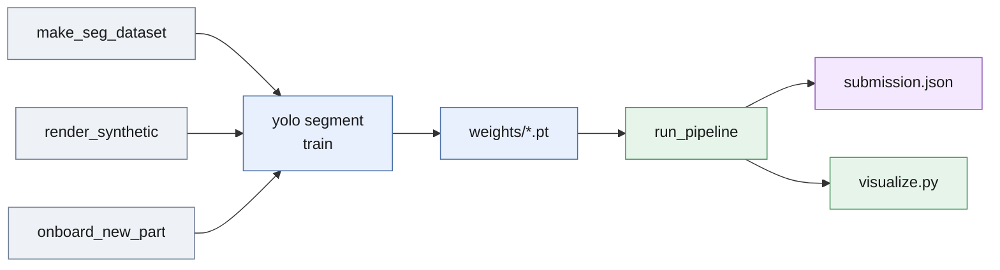
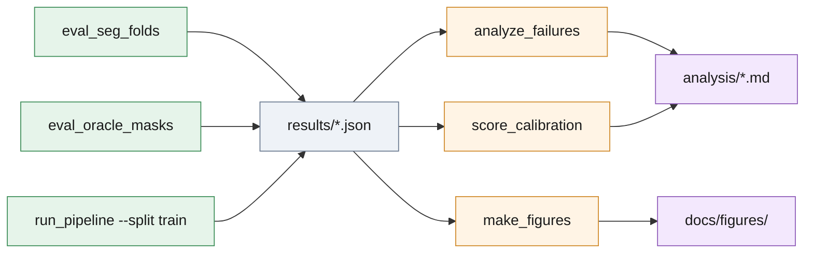

# `scripts/` — how every artefact in the repo was produced

Ten scripts and one helper module. Each script has a docstring with its
exact command line; run them from the repository root with
`.venv/bin/python` (or `.venv/bin/blenderproc` for the renderer). Full
commands with the shipped hyper-parameters are in
[report.md, Reproducing](../report.md#reproducing).

**Data and weights to submission**

*Real train scenes or synthetic renders become a YOLO dataset, Ultralytics
trains the segmenter, `run_pipeline` writes the submission and a labels
folder the released `visualize.py` draws.*

**Results to analysis and figures**

*Every table row is a prediction JSON in `results/` that `score.py`
re-scores; the studies and plots read those files, nothing else.*

| Script | What it does | Typical command | Writes |
| --- | --- | --- | --- |
| [`run_pipeline.py`](run_pipeline.py) | Full detection + pose pipeline over a split. `--seg-model` / `--extra-seg-model` select the learned-mask path (geometric detector without them); `--pick` stops at the first pose scoring ≥ 0.8; `--imgsz` sets the segmenter input side; `--no-hole-cue`, `--passes`, `--scenes`, `--workers` | `scripts/run_pipeline.py --root <release> --split test --out submission.json --labels-out pred_test --seg-model weights/part-seg.pt --extra-seg-model weights/part-seg-synthetic.pt` (what [run_all.sh](../run_all.sh) runs) | submission JSON; optional labels folder for `visualize.py` |
| [`eval_seg_folds.py`](eval_seg_folds.py) | Leave-scenes-out CV of the learned-mask path: each fold model predicts only the scenes it never saw. `--extra-weights` pools a second segmenter, `--conf`, `--imgsz`, `--weights` (one model on every scene, only honest for a model that never saw train), `--ablate <stage>` with stage in no_flips, no_grid, no_polish, no_gate, no_own_mask, no_hole_cue | `scripts/eval_seg_folds.py --root . --runs seg_runs_l --conf 0.25 --extra-weights weights/part-seg-synthetic.pt --out results/train_ensemble_run1.json` | [`results/train_*.json`](../results/README.md), `ablation_*.json`, `nano_*.json` |
| [`eval_oracle_masks.py`](eval_oracle_masks.py) | Registration ceiling: ground-truth masks straight into the pose estimator | `scripts/eval_oracle_masks.py --root . --workers 6 --out results/train_gt_masks.json` | `results/train_gt_masks.json` |
| [`analyze_failures.py`](analyze_failures.py) | Per-instance post-mortem with `score.py`'s own matching: misses, flips, duplicate labels, false positives, crops | `scripts/analyze_failures.py --root . --submission results/train_ensemble_run1.json --out analysis` | tables inside [`analysis/failure_analysis.md`](../analysis/failure_analysis.md), `analysis/failures/*.png` |
| [`score_calibration.py`](score_calibration.py) | Is `score` a calibrated confidence: reliability bins, ECE, operating points per gate, top-1 audit (`--components` splits the two factors) | `scripts/score_calibration.py --root . --submission results/train_ensemble_run1.json --out analysis` | [`analysis/score_calibration.md`](../analysis/score_calibration.md), `analysis/score_calibration.png` |
| [`make_figures.py`](make_figures.py) | The seven plots in `docs/figures/`; every accuracy number in them is re-scored from `results/` with `score.py`. [`figure_helpers.py`](figure_helpers.py) holds its scoring, saving and contact-sheet helpers (not a script) | `scripts/make_figures.py --root . --out docs/figures` | `docs/figures/*.png` |
| [`make_seg_dataset.py`](make_seg_dataset.py) | Train scenes → YOLO-seg dataset; labelled and ignore masks both become "part"; `--val-scenes` holds scenes out for a CV fold | `scripts/make_seg_dataset.py --root . --out seg_data/fold0 --val-scenes 000007 000014 000021 000033 000047` | `seg_data/<fold>/` (images, labels, `data.yaml`) |
| [`render_synthetic.py`](render_synthetic.py) | Domain-randomised BlenderProc renders of the CAD with YOLO-seg labels; part colour, lights, tray, camera all randomised | `.venv/bin/blenderproc run scripts/render_synthetic.py -- --cad model/3d_model.ply --out seg_data/synthetic --frames 1200` | `seg_data/synthetic/` |
| [`onboard_new_part.py`](onboard_new_part.py) | New part with zero hand labels: render, carve a val split, train YOLO11m-seg in one go | `scripts/onboard_new_part.py --cad model/3d_model.ply --workdir onboard_part --frames 1200 --epochs 80` | `<workdir>/train/weights/best.pt` |
| [`merge_submissions.py`](merge_submissions.py) | Union of two submissions, de-duplicated with the detector's own NMS rule | `scripts/merge_submissions.py a.json b.json --out merged.json` | merged submission JSON |

Fold membership for the CV rows is `FOLD_VAL_SCENES` in
`eval_seg_folds.py`; the fold models themselves (`seg_runs_l/`, `seg_runs_n/`)
are training outputs and are not committed. `blenderproc` is needed only by
the two synthetic-data scripts and is not in `requirements.txt`.
