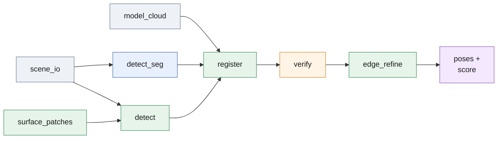

# `src/` — the pose pipeline

Eight modules, no framework. Masks propose, classical RGB-D geometry
registers, the depth map verifies. Entry points used by `scripts/` and
`deploy/` are listed per module below.

*A scene becomes masks (learned or geometric), each mask becomes a point
cloud that `register` fits to the CAD, `verify` judges every candidate
against the depth map, `edge_refine` polishes the winner; `nms` (in
`detect`) de-duplicates the final poses.*

| Module | Responsibility | Key entry points |
| --- | --- | --- |
| [`scene_io.py`](scene_io.py) | Load one scene (RGB, depth in metres, intrinsics); back-project depth to a camera-frame cloud | `Scene`, `list_scenes`, `load_scene`, `backproject`, `backproject_pixels` |
| [`model_cloud.py`](model_cloud.py) | Sample the CAD at two densities, precompute FPFH, discover the through-holes and plate axis | `ModelCloud`, `load_model_cloud` |
| [`detect_seg.py`](detect_seg.py) | Learned masks (Ultralytics) as proposals; part-colour gate; own-mask check; pick mode; geometric safety net when too little verifies | `masks_from_model`, `detect_from_masks`, `detect_scene_hybrid` |
| [`detect.py`](detect.py) | Training-free detector: HSV part mask, pile splitting, top-of-pile registration, hole-pair proposals; NMS shared by both paths | `part_pixel_mask`, `foreground_depth_mask`, `detect_scene`, `extract_instances`, `nms` |
| [`surface_patches.py`](surface_patches.py) | Cut a pile into smooth faces at depth and normal breaks | `normal_map`, `surface_patches` |
| [`register.py`](register.py) | FPFH-RANSAC init, coarse-to-fine point-to-plane ICP, flip rivals, rotation-grid fallback, candidate ranking; the flips / grid / polish / hole-cue switches | `PoseEstimator` (`estimate`, `estimate_from_holes`, `refine_local`, `distance_to_model`), `PoseEstimate`, `flip_transforms`, `grid_rotations` |
| [`verify.py`](verify.py) | Render-free depth-map test: support vs free-space violation; RGB hole cue against a half-turn | `Verdict`, `verify_pose`, `hole_conflict`, `depth_slope` |
| [`edge_refine.py`](edge_refine.py) | Final polish: deadzoned Gauss-Newton on the mesh plus hole-centre alignment in the image | `PosePolisher` (`set_scene`, `polish`) |

Conventions follow [ASSIGNMENT.md](../ASSIGNMENT.md#conventions): a pose is
`T_camera_object`, the camera frame is OpenCV (+X right, +Y down, +Z forward),
translations and the CAD are in metres, `R` is row-major 3×3. Depth PNGs are
integer millimetres scaled by `camera.json["depth_scale"]`.

The submission `score` of a pose is `PoseEstimate.submission_score` =
depth verification confidence × proposing segmenter confidence. Constants
that tune a stage sit at the top of the module that owns it, each with a
comment saying why it has that value. What each stage buys is measured in
[analysis/ablation.md](../analysis/ablation.md); where the time goes in
[analysis/runtime.md](../analysis/runtime.md).
