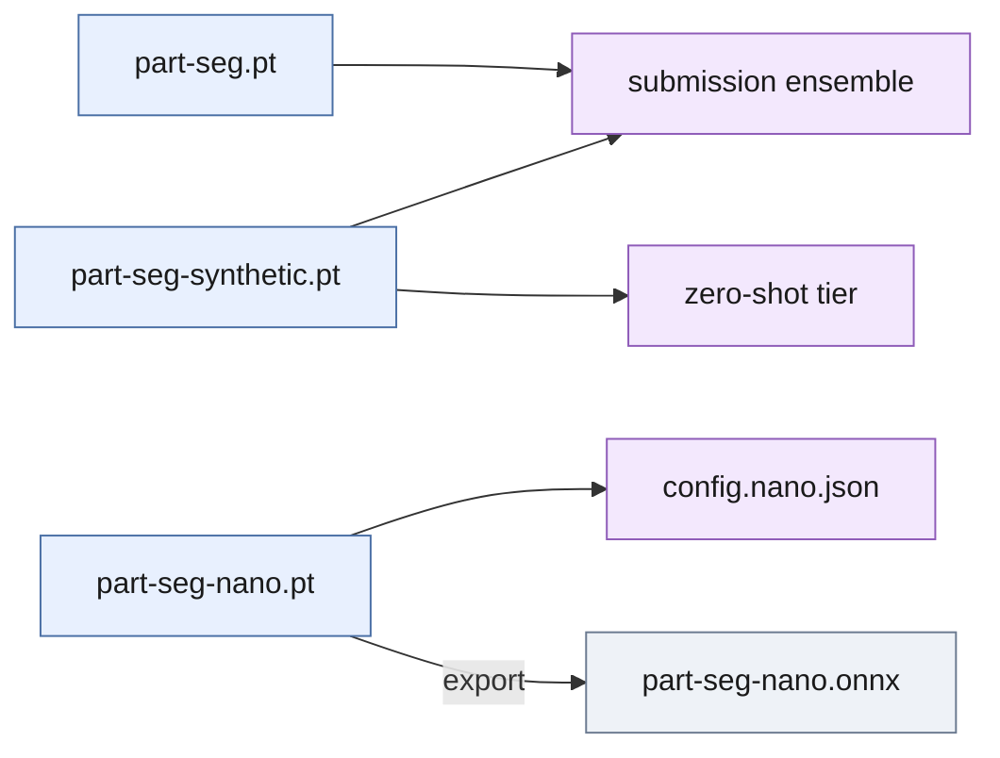

# `weights/` — the trained segmenters

Four files, one segmentation class ("part"). Everything else in the pipeline
reads the CAD at load time and needs no weights. Training recipes, with the
exact hyper-parameters, are in [report.md, Reproducing](../report.md#reproducing)
and [analysis/edge_model.md](../analysis/edge_model.md).

*The two large models pool their proposals for the submission; the synthetic
one alone is the no-real-data tier; the nano model is what the Jetson runs.*

| File | Architecture | Trained on | imgsz | Size | Used by | AR it reaches (CV, `results/`) |
| --- | --- | --- | --- | --- | --- | --- |
| `part-seg.pt` | YOLO11l-seg (27.6 M params) | all 20 real train scenes, labelled + ignore masks, rotation/flip augmentation | 960 | 55.9 MB | `run_all.sh`, [submission](../submission.json), `deploy/pose_service` default | 0.815 alone at conf 0.4 (`train_yolo11l_single.json`); **0.851** in the ensemble (`train_ensemble_run1.json`) |
| `part-seg-synthetic.pt` | YOLO11m-seg (22.4 M) | 1140 domain-randomised BlenderProc renders of the CAD, no real image | 960 | 45.2 MB | second segmenter of the submission ensemble; zero-shot tier on its own | 0.814 alone, top-1 1.000 (`train_synthetic_only.json`) |
| `part-seg-nano.pt` | YOLO11n-seg (2.84 M) | all 20 real train scenes, same recipe at 640 | 640 | 6.0 MB | [`deploy/jetson-nano/config.nano.json`](../deploy/jetson-nano/config.nano.json): one segmenter, pick mode | 0.837 mean of three draws (`nano_yolo11n_640*.json`); 49 ms per frame CPU vs 619 ms for `part-seg.pt` |
| `part-seg-nano.onnx` | export of `part-seg-nano.pt`, opset 12, static input `[1,3,640,640]` | — | 640 | 11.6 MB | nothing yet: for TensorRT or other runtimes; validated with `onnx.checker` only, never executed | — |

The CV rows come from fold models trained with the same recipe on 15 of the
20 scenes at a time (`seg_runs_l/`, `seg_runs_n/`, not committed); the
shipped `.pt` files saw all 20. Sizes are `os.path.getsize` in MB (10^6
bytes). The board runs `part-seg-nano.pt` through torch, not the `.onnx`
file ([analysis/edge_model.md, ONNX export](../analysis/edge_model.md#onnx-export)).
The COCO-pretrained starting checkpoints (`yolo11l-seg.pt`, `yolo11m-seg.pt`,
`yolo11n-seg.pt`) are downloaded by Ultralytics at train time and are not
committed; inference needs only the files here.
